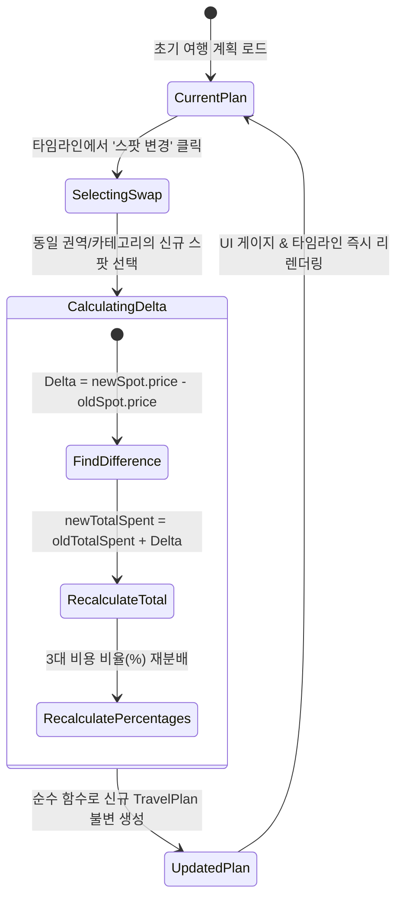

# [Specification] 3대 비용 밸런싱 알고리즘 및 계산 엔진 명세서

> **문서 버전**: v1.0.0  
> **상태**: 승인됨 (Approved)  
> **모듈 위치**: `src/services/budgetCalculator.ts`  
> **테스트 커버리지**: `src/services/__tests__/budgetCalculator.test.ts` (100% 통과)  

---

## 1. 개요 및 설계 목적

부산 골목 밸런서의 핵심 경쟁력은 **"사용자가 입력한 예산 내에서 교통비, 식음료, 입장료를 1원의 오차도 없이 배분하고, 남은 금액을 명확한 비상금으로 제시하는 것"**입니다.

본 문서는 예산 배분 알고리즘(Combinatorial Knapsack Variant with Categorical Constraints)과 스팟 변경 시 발생하는 상태 전이 및 불변 차액 갱신 메커니즘을 수학적/기술적으로 정의합니다.

---

## 2. 비용 계산 모델 및 제약 조건

### 2.1 3대 비용 분할 공식 (The 3-Pillar Cost Equation)

$$TotalCost = Cost_{transit} + Cost_{food} + Cost_{cafe} + Cost_{admission} + Cost_{snack}$$

$$RemainingBudget = Budget_{user} - TotalCost \quad (RemainingBudget \ge 0)$$

1. **교통비 ($Cost_{transit}$)**:
   - 여행 시작 전 최우선으로 차감되는 **고정 사전 차감 비용(Fixed Pre-deduction)**입니다.
   - 대중교통+도보: 기본 시내버스/지하철 1회 + 환승 1회 왕복 = **3,100원**
   - 편안한 택시: 골목 진입 및 복귀 기본/단거리 택시 요금 = **9,000원**
2. **식음료비 ($Cost_{food} + Cost_{cafe}$)**:
   - 권역 내 대표 식당 1곳 + 스페셜티 카페/디저트 1곳.
3. **입장/체험비 ($Cost_{admission}$)**:
   - 유료/무료 전시, 공방 체험, 소품샵 투어 비용.
4. **간식 및 골목 비상금 ($Cost_{snack} + RemainingBudget$)**:
   - 길거리 간식(호떡, 물떡, 어묵 등) 또는 예산 잔여액(현장 소품 구매 및 비상금).

---

## 3. 최적 조합 탐색 알고리즘 (Combinatorial Knapsack Algorithm)

본 엔진은 카테고리 제약 조건이 있는 다차원 배낭 문제(Multiple-Choice Knapsack Problem)의 변형을 브라우저 클라이언트에서 실시간(10ms 이내)으로 연산합니다.

### 3.1 탐색 프로세스

```text
[입력]: Budget, DistrictId, TravelTheme, TransitType

1. District 및 Transit 확정:
   - TransitCost 사전 할당 (3,100원 또는 9,000원)
   - AvailableBudget = Budget - TransitCost

2. 권역 내 스팟 그룹화:
   - Group F = { spot ∈ SPOTS | spot.category == 'food' }
   - Group C = { spot ∈ SPOTS | spot.category == 'cafe' }
   - Group A = { spot ∈ SPOTS | spot.category == 'admission' }
   - Group S = { spot ∈ SPOTS | spot.category == 'snack' } ∪ { null }

3. 4중 전수 탐색 및 유효 조합 필터링:
   For each f ∈ F:
     For each c ∈ C:
       For each a ∈ A:
         For each s ∈ S:
           SubTotal = f.price + c.price + a.price + (s ? s.price : 0)
           If (TransitCost + SubTotal <= Budget):
              Score = CalculateScore(Combo, Budget, TravelTheme)
              If (Score > BestScore):
                 BestCombo = Combo
                 BestScore = Score

4. 반환:
   If (BestCombo != null) -> BestCombo 기반 CourseItem[] 및 CostBreakdown 생성
   Else -> Deterministic Fallback 실행 (최저가 조합 구성)
```

### 3.2 목적 함수 및 스코어링 공식 (Scoring Function)

$$Score = \left( \frac{TotalCost}{Budget_{user}} \times 100 \right) + Bonus_{theme}$$

- **예산 최적화 항 ($\frac{TotalCost}{Budget} \times 100$)**:
  - 예산을 최대한 알차게 활용할수록(낭비 없이 만족도 높은 소비를 할수록) 높은 기본 점수를 부여합니다.
- **테마 가중치 보너스 ($Bonus_{theme}$)**:
  - `cafe_dessert` 테마: 카페 지출액 $\ge 6,500$원일 때 $+10$점 가산
  - `local_food` 테마: 식당 태그에 `'로컬노포'` 포함 시 $+10$점 가산
  - `ocean_healing` 테마: 입장 스팟 태그에 `'해안산책로'` 포함 시 $+10$점 가산
  - `retro_culture` 테마: 입장 스팟 태그에 `'헌책방거리'` 포함 시 $+10$점 가산

---

## 4. 예산 초과 방지 및 Fallback 전략

사용자가 극단적으로 낮은 예산(예: 20,000원)을 입력하여, 어떤 정상 조합도 $TransitCost + SubTotal \le Budget$을 만족하지 못할 경우:

1. **Deterministic Fallback 작동**:
   ```typescript
   const minFood = [...foodSpots].sort((a, b) => a.price - b.price)[0];
   const minCafe = [...cafeSpots].sort((a, b) => a.price - b.price)[0];
   const minAdmission = [...admissionSpots].filter(s => s.isFree)[0] 
     || [...admissionSpots].sort((a, b) => a.price - b.price)[0];
   ```
2. **사용자 경험(UX) 보장**:
   - 에러 모달이나 중단 없이, "해당 권역의 무료 공공 스팟 위주로 알뜰하게 설계된 코스"를 즉시 렌더링하고, 상단 게이지 바에 `절약 팁` 문구를 안내합니다.

---

## 5. 실시간 스팟 교체(Swap) 메커니즘

사용자가 특정 장소를 변경할 때, 전체 코스를 새로고침하지 않고 **해당 슬롯만 교체하면서 비용을 재정산**합니다.



### 5.1 불변성 및 데이터 정합성 보장 (`swapSpotInPlan`)
```typescript
export function swapSpotInPlan(
  plan: TravelPlan,
  itemOrder: number,
  newSpotId: string
): TravelPlan {
  const newSpot = SPOTS_DATA.find((s) => s.id === newSpotId);
  if (!newSpot) return plan;

  // 1. 코스 아이템 불변 복사 및 특정 인덱스 교체
  const updatedItems = plan.items.map((item) => {
    if (item.order === itemOrder) {
      const remainingAlts = [
        item.spot,
        ...item.alternativeSpots.filter((s) => s.id !== newSpotId),
      ];
      return {
        ...item,
        spot: newSpot,
        cost: newSpot.price,
        alternativeSpots: remainingAlts,
      };
    }
    return item;
  });

  // 2. 전체 비용 및 3-Pillar 지출액 즉시 재계산
  const breakdown = calculateCostBreakdown(
    plan.preference.transitType,
    updatedItems,
    plan.preference.budget
  );

  return {
    ...plan,
    items: updatedItems,
    costBreakdown: breakdown,
    savingsInsight: generateSavingsInsight(breakdown, plan.preference.budget),
  };
}
```

---

## 6. 테스트 및 검증 결과

`src/services/__tests__/budgetCalculator.test.ts`를 통해 다음 핵심 사양을 100% 자동 검증하고 있습니다:
1. `generateTravelPlan`: 50,000원 입력 시 지출 합계 $\le$ 총 예산 일치 확인.
2. `3-Pillar Breakdown`: 교통비, 식음료, 입장료 비율 합이 100% 및 0원 이상의 비상금 보존 확인.
3. `극단적 예산(Boundary)`: 20,000원 입력 시에도 안전 Fallback(무료 스팟 포함)으로 정상 작동 확인.
4. `swapSpotInPlan`: 스팟 교체 시 순서 유지 및 게이지 바 지출액 1원 단위 정확성 확인.
