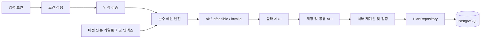

# P1. 시스템 성능 개선 — 실행 계획과 아키텍처

상태: 제안 · 상위 문서: [통합 계획](README.md) · 예상: 10~14 작업일

## 1. 목표와 범위

사용자가 예산·인원·장소를 바꿀 때 정확한 결과를 빠르게 받고, 저장한 코스를 다른 기기에서도 다시 여는 기반을 만든다. P2/P3가 재사용할 카탈로그와 API/DB도 이 단위가 소유한다.

성능 범위는 초기 로딩, 입력 응답, 코스 탐색, API/DB 응답이다. 데이터 영속성 및 잘못된 성공 응답 수정은 성능 수치와 별도 항목으로 보고한다. 현재 병목의 크기는 아직 측정하지 않았다.

## 2. 코드에서 확인한 문제

- App.tsx: 네 탭을 정적 import하며 조건 변경 시 생성·저장·confetti가 같은 흐름에 묶인다.
- budgetCalculator.ts: O(F × C × A × (S+1)) 조합 탐색, 반복 filter, partySize 미반영.
- 같은 모듈의 fallback은 예산 초과 가능. remainingBudget를 0으로 잘라 초과 정도를 표현하지 못한다.
- swapSpotInPlan은 요청 장소의 원래 권역/카테고리 일치 및 교체 후 예산 정책을 충분히 강제하지 않는다.
- planApi.ts: API 실패 시 실제 저장하지 않은 local-* 공유 링크를 success로 반환한다.
- planStorage.ts: Map으로 저장해 프로세스 재시작 시 유실된다.
- 현재 교통 코드의 comfort_taxi는 8,500원이며 기존 아키텍처 문서의 9,000원과 다르다. 둘 다 최신 실제 요금이라는 근거는 없다. 검수 전에는 기존 코드 값을 데모 추정치로 표시한다.

## 3. 아키텍처



엔진을 UI와 서버에서 함께 사용하되 브라우저가 보낸 합계를 신뢰하지 않는다. 엔진은 현재 시각·난수·localStorage를 호출하지 않고 입력과 카탈로그만으로 동작한다.

### 계산 정책 초안

- 총예산은 모든 여행자의 합계다. partySize는 첫 버전에서 1~8명, budgetKRW는 1~1,000,000원의 정수로 제한한다. 기존 슬라이더 범위는 UI 프리셋으로 유지하고 직접 입력을 지원할 수 있다.
- 일반 장소의 price는 perPerson으로 이관한다. 비용 필드는 unitPriceKRW와 pricingUnit으로 분리한다.
- 대중교통 비용 = 인당 추정 비용 × 인원.
- 혼합 교통은 perPersonLegKRW × 인원 + perVehicleLegKRW × ceil(인원 / vehicleCapacity)로 계산한다. 기존 8,500원을 그대로 인원 수만큼 곱하지 않는다. 구성 값은 검수된 데모 fixture로 확정하고 정책 버전을 붙인다.
- 필수 카테고리: 음식·카페·체험. 간식은 선택이다. 필수 카테고리가 없거나 최저 비용도 초과하면 infeasible을 반환한다. 자동으로 예산을 높이거나 방문 항목을 숨기지 않는다.
- 같은 점수일 때 spotId 사전순으로 선택해 결과를 결정적으로 만든다. 테마 점수·예산 소진 점수는 초기에는 기존 정책을 유지하여 성능 비교와 추천 정책 변경을 분리한다.
- 교체는 같은 권역·카테고리의 유효 장소만 허용한다. 초과하면 원래 코스를 유지하고 필요한 추가 금액을 반환한다.
- totalSpent + remainingBudget = budgetKRW를 만족한다. 초과 제안은 정식 plan 대신 reason/additionalBudgetKRW로 표현한다.

### 엔진 인터페이스

```ts
type PlannerInput = {
  budgetKRW: number;
  partySize: number;
  districtId: DistrictId | 'all';
  theme: TravelTheme;
  transitType: TransitType;
  candidateSpotIds?: string[];
};

type CatalogSnapshot = {
  version: string;
  pricingPolicyVersion: string;
  spots: readonly CatalogSpot[];
  transit: TransitPricing[];
};

buildPlan(input: PlannerInput, catalog: CatalogSnapshot): PlanningResult;
swapPlanSpot(plan: PlanV2, order: number, spotId: string,
  catalog: CatalogSnapshot): PlanningResult;
```

## 4. 최적화 단계와 검증

1. 기준선: 기존 엔진 그대로 측정. 정확성 결함도 별도 기록.
2. 정확성 기준선: P1-02 정책을 적용한 느리지만 명확한 참조 구현을 fixture의 정답으로 사용.
3. 권역/카테고리/ID 인덱스: 카탈로그 버전당 1회 구성.
4. 가격 정렬 및 부분 합계 하한으로 가지치기. 같은 해와 점수를 보존하는 최적화부터 적용.
5. LRU 캐시 초기 제한 100개: 정규화 입력 + catalogVersion + pricingPolicyVersion + 후보 ID 집합. ID/시각은 캐시 밖에서 생성.
6. 1천 장소에서 목표 실패 시 Worker와 후보 축소를 별도 실험. 후보 축소는 approximation=true와 점수 손실을 보고하고 정확 탐색 결과로 오인하지 않게 한다.

Worker 적용 시 카탈로그는 버전 변경 때만 전달하고 requestId가 최신인 결과만 UI에 반영한다. 새 요청 시 이전 작업 취소 또는 오래된 응답 무시를 보장한다.

UI는 draft 입력과 applied 입력을 나눈다. 초기 적용은 명시적 버튼으로 하고, 슬라이더 미리보기는 150ms 지연 계산을 실험해 선택한다. 자동 저장/축하 효과는 확정 시점에만 실행한다. 탭·모달·confetti는 동적 import하고 React memo는 프로파일링으로 효과가 확인되는 경계에만 적용한다.

## 5. 영속 데이터와 API

| 테이블 | 핵심 필드 | 제약/인덱스 |
| --- | --- | --- |
| catalog_versions | id, pricing_policy_version, created_at, active | 활성 버전 전환은 transaction |
| spots | id, district_id, name, active | id PK, district/category 조회 인덱스는 버전 테이블에 배치 |
| spot_versions | catalog_version, spot_id, category, unit_price_krw, pricing_unit, payload | 복합 PK, 가격 비음수, 권역/카테고리 인덱스 |
| plans | id, slug, schema_version, catalog_version, snapshot_json, created_at | slug UNIQUE, 서버 검증 snapshot |
| request_dedup | scope, idempotency_key, request_hash, response_json, expires_at | scope/key UNIQUE, 다른 본문으로 재사용 시 409 |

spot_versions는 동일 버전의 가격 재현에 사용한다. plan snapshot에는 저장 시점의 명칭·가격을 담고 현재 가격으로 조용히 덮어쓰지 않는다. 기존 조회/좋아요 계약은 보존하되 인기 순위의 고도화는 첫 범위에 추가하지 않는다.

| API | 입력 | 응답/처리 |
| --- | --- | --- |
| GET /api/v1/catalog | version 선택 | 버전·장소·가격 규칙, ETag 조건부 조회 |
| POST /api/v1/plans | preference, orderedSpotIds, catalogVersion + Idempotency-Key | 서버가 다시 계산 후 201: slug, snapshot |
| GET /api/v1/plans/:slug | slug | 저장 당시 snapshot. 없음은 404 |
| GET /api/v1/health | 없음 | 최소 상태. 연결정보 등 내부 설정 미노출 |

카탈로그 버전이 없거나 오래되어 저장을 지원하지 못하면 409와 재계산 안내. POST timeout 후 동일 키 재시도는 같은 저장 결과를 반환한다. 브라우저 로컬 저장은 유지 가능하지만 공유 성공으로 표시하지 않는다.

기존 localStorage는 schemaVersion 없는 값을 legacy로 분류한다. 읽기 검증 → v2로 변환 가능한 항목만 이관 → 합계 재검증 → 변환 실패 항목 안내 순서로 처리한다. 검증 전에 기존 키를 삭제하지 않는다. 서버 Map의 런타임 자료는 자동 migration 가능하다고 가정하지 않는다. 샘플 seed와 실제 사용자 자료를 구분한다.

## 6. 작업 분해

아래 작업은 각각 Issue/PR 한 개 또는 검토 가능한 소수의 PR로 수행한다. 합계 예상은 통합 검증을 포함한 10~14일이다.

| ID / 순서 | 작업 및 주요 경로 | 선행 | 완료 조건 | 예상 |
| --- | --- | --- | --- | --- |
| P1-01 | package scripts, benchmarks/, docs/reports/: 테스트/빌드 재현과 기준 측정 | 없음 | 환경·fixture·raw 결과·실패 원인 기록 | 1~2일 |
| P1-02 | domain/types, pricing, validation 및 기존 facade | 01 | 인원/예산/교체/불가능 상태의 테스트와 계약 확정 | 2일 |
| P1-03 | domain/planning, indexes, cache | 02 | 작은 fixture 참조 해와 일치, 1천 장소 p95 결과 | 2일 |
| P1-04 | App.tsx 및 각 탭/모달 | 02 | 입력 중 부수 효과 제거, 지연 로딩, 이전 요청 결과 미반영 | 1~2일 |
| P1-05 | server/application, repository 인터페이스, /api/v1 DTO | 02 | 잘못된 합계/ID 요청 거절, 구 API 호환 테스트 | 1일 |
| P1-06 | db/migrations, PostgreSQL repository, 독립 API 실행 | 05 | 재시작 후 복원, 멱등 저장, 로컬 이관 실패 처리 | 2~3일 |
| P1-07 | 브라우저/API 통합 및 전후 보고서 | 03/04/06 | 저장/공유/재접속 성공, 성능 회귀 원인 기록 | 1~2일 |

## 7. 테스트·성능 목표·출시 기준

- 엔진: 정수/경계 인원/빈 카테고리/모든 조합 초과/무료 장소/다른 권역 교체/합계/입력 불변성 테스트.
- 속성 검증: 임의의 유효 입력에서 ok이면 모든 가격이 비음수이고 예산 내이며 카테고리·권역 조건 충족.
- API: 잘못된 본문·가짜 합계·동시 같은 멱등 키·DB 중단·과거 버전·서버 재시작.
- UI: 20회 빠른 조건 변경, 탭 왕복, 공유 실패, 저장 데이터 손상. 결과 최신성과 오류 표시 확인.
- benchmark fixture: 원본 + seed 고정 1천/1만 장소, 권역 균등 및 특정 카테고리 편중. 10회 warm-up 후 100회 측정. 건당 상한 2초 초과는 timeout 기록, p95 집계에서 조용히 제외하지 않는다.
- 제안 목표: 1천 장소 생성 p95 ≤100ms, API 조회 p95 ≤300ms(동시 10 클라이언트·1만 저장 코스·로컬 고정 환경). 환경 명세를 P1-01에서 확정한다.
- JS gzip 25% 축소를 시도하되 효과 없는 분할을 강제하지 않는다. 실측 번들 크기 및 사용자 작업 지연을 함께 보고한다.
- Web Vitals 목표는 LCP 2.5초/INP 200ms/CLS 0.1 이하이며 실제 방문 p75에서 판단한다. 실험실 수치를 현장 INP로 보고하지 않는다. [공식 기준](https://web.dev/articles/vitals).

산출물: baseline.json, after.json, fixture metadata, 성능 보고서, API 계약, migration, 재현 README. 이름은 구현 시 확정한다. 목표 미달이면 수치와 원인을 공개하고 P2 진입 전 계산 정확성/저장 복원 게이트는 반드시 통과한다.

## 8. 롤아웃과 복구

engineV2는 내부 전환 옵션으로 먼저 비교하되 잘못된 구 계산 정책으로 사용자를 자동 회귀시키지 않는다. API/DB는 호환 읽기와 새 쓰기를 단계적으로 적용한다. UI 성능 변경은 독립적으로 되돌릴 수 있어야 한다. migration 복구는 백업 검증과 구 읽기 유지로 준비하며 파괴적 down migration을 기본 절차로 삼지 않는다.
