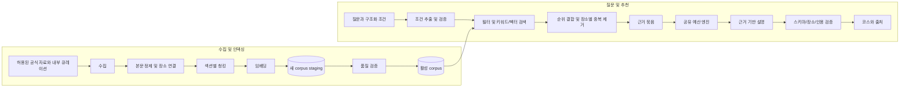

# P2. 부산 골목 RAG 시스템 — 실행 계획과 아키텍처

상태: 제안 · 상위 문서: [통합 계획](README.md) · 예상: 8~12 작업일

## 1. 목표와 첫 릴리스

사용자가 자연어로 여행 조건을 설명하면 검수된 장소 자료에서 근거를 찾아 예산 내 코스를 추천한다. “추천 이유”, “비 오는 날 대안”, “저렴한 대체 장소”에 출처와 확인 상태를 표시한다.

첫 릴리스는 전포 권역과 허용된 자료 20~50개를 목표로 하되 수량보다 근거 품질을 우선한다. 기존 큐레이션 자료에는 내부 출처임을 표시한다. 실시간 영업 확인, 자유로운 인터넷 검색 에이전트, 자동 예약, 사용자의 임의 URL 수집은 포함하지 않는다.

선행: P1의 spotId/catalogVersion, 예산 엔진, PostgreSQL, 독립 API. 수집·검색 실험은 P1과 분리된 fixture로 먼저 가능하다.

## 2. 두 개의 파이프라인



검색과 생성 모듈은 분리한다. 검색 결과를 직접 평가할 수 있어야 모델 표현력으로 검색 실패가 가려지지 않는다. 첫 버전은 단일 요청형 흐름이며 자율 도구 호출 루프를 도입하지 않는다.

## 3. 수집·문서·가격 관리

| 테이블 | 핵심 필드와 제약 |
| --- | --- |
| rag_sources | id, URL, provider, 허용 범위/이용 조건 메모, 수집 주기, 활성 상태 |
| rag_documents | id, source_id, source_item_id, content_hash, title, body, published_at, fetched_at, verified_at, state |
| rag_document_spots | document_id, spot_id, 연결 근거와 검수 상태; 복합 UNIQUE |
| rag_corpora | id, embedding_model_id, embedding_dimension, chunker_version, state, created_at |
| rag_chunks | id, corpus_id, document_id, section, text, embedding, language, source_locator |
| rag_ingest_runs | id, source_id, 시작/종료, 변경/실패 건수, 실패 코드 |
| rag_eval_runs | id, dataset_version, corpus_version, 모델/검색 설정, 지표·비용·실행 정보 |

활성 corpus는 전환 가능한 포인터로 관리한다. 문서 동일성은 source_id/source_item_id/content_hash로 판단하여 재실행 시 임베딩을 중복 생성하지 않는다. embedding 모델이나 차원을 바꿀 때는 새 corpus를 생성하고 서로 다른 차원의 벡터를 섞지 않는다.

가격은 P1 카탈로그가 소유한다. 문서에서 추출한 요금은 검수 대기 후보로 저장하고 자동으로 카탈로그를 덮어쓰지 않는다. publishedAt/fetchedAt/verifiedAt을 구분하며 “오늘 수집”을 “오늘 영업 확인”으로 해석하지 않는다. 문서가 삭제·비활성화되면 새 corpus에서 제외하고 기존 응답 캐시도 버전으로 무효화한다.

초기 청킹 실험값: 섹션을 보존한 300~600 토큰, 필요 시 최대 60 토큰 겹침. 서로 다른 장소를 하나의 청크에 합치지 않는다. 표나 이용 안내의 제목을 포함한다. 문서가 여러 장소를 다루면 관계 테이블과 청크 메타데이터로 연결한다.

## 4. 검색과 코스 생성 알고리즘

1. 입력 길이를 최대 1,000자로 제한하고 예산·인원·권역 등은 P1 스키마로 검증한다. 명시적 폼 값과 자연어가 충돌하면 clarify 상태를 반환한다. 누락된 총예산/인원은 조용히 추측하지 않는다.
2. 권역/활성 장소/자료 유효성을 검색 단계에서 필터한다. 장소 가격 필터는 P1 비용 단위로 환산하며 코스 총액 검증은 엔진에서 수행한다.
3. 장소명·별칭·태그 검색과 벡터 검색에서 각각 상위 20개를 얻는다. 기본 전문 검색의 한국어 토큰화 한계를 고려해 정규화·별칭과 필요 시 trigram을 비교한다.
4. Reciprocal Rank Fusion의 초기 k=60으로 결합하고 장소별 중복을 줄인다. 상위 6~8개 근거 청크를 선택한다. 숫자는 고정 평가셋으로 조정한다.
5. “조용함” 같은 취향은 soft preference로 처리한다. “계단 없음”처럼 필수 조건으로 지정된 속성은 명시적 근거가 없으면 충족으로 표시하지 않는다.
6. 후보 장소 ID를 예산 엔진에 전달한다. 필수 카테고리가 없거나 불가능이면 검색 후보를 한 번 확대한다. 다시 실패하면 추천 불가/조건 조정 또는 기본 플래너를 명시적으로 제안한다.
7. 엔진이 정한 장소·합계와 검색 근거만 생성 모델에 전달하여 설명한다. 모델이 코스 비용이나 장소를 임의 변경하지 못하게 한다.
8. 반환된 spotId/sourceId/인용 범위와 구조를 검증한다. 유효하지 않은 인용은 제거 후 정형 설명으로 대체하거나 insufficient_evidence로 처리한다.

작은 corpus는 정확 벡터 검색으로 시작한다. 규모가 커져 지연 목표를 넘으면 HNSW를 비교하고, 필터 적용 시 상위 k개가 충분히 반환되는지 Recall과 함께 측정한다. [pgvector 공식 문서](https://github.com/pgvector/pgvector).

## 5. API와 UI 계약

### POST /api/v1/recommendations

입력 예시:

```json
{
  "query": "조용한 카페와 로컬 맛집을 포함해줘",
  "constraints": {
    "budgetKRW": 70000,
    "partySize": 2,
    "districtId": "jeonpo",
    "theme": "local_food",
    "transitType": "transit_walk"
  },
  "catalogVersion": "catalog-demo-v2"
}
```

응답 data는 아래 discriminated union으로 설계한다.

```ts
type RecommendationResult =
  | { status: 'ok'; plan: PlanV2; claims: CitedClaim[];
      sources: SourceReference[]; catalogVersion: string; corpusVersion: string }
  | { status: 'clarify'; question: string; fields: string[] }
  | { status: 'insufficient_evidence'; reason: string }
  | { status: 'infeasible'; reason: string; suggestedChanges: string[] };

type CitedClaim = { text: string; spotId?: string; sourceIds: string[] };
type SourceReference = {
  id: string; title: string; url?: string; sourceKind: 'internal' | 'external';
  publishedAt?: string; fetchedAt: string; verifiedAt?: string;
};
```

모델/DB 장애는 503 MODEL_UNAVAILABLE 또는 RETRIEVAL_UNAVAILABLE로 반환하며 근거 부족과 구분한다. requestId는 공통 envelope에 있다. 첫 버전은 완성된 JSON 응답으로 시작하고 SSE는 응답 상태 복잡도를 평가한 뒤 확장한다.

UI는 입력 → 검색 중 → 완료/질문 필요/근거 부족/조건 불가능/장애를 표시한다. 추천 코스를 적용하기 전 현재 코스와 예상 비용을 비교할 수 있게 한다. 출처는 주장 옆에서 확인할 수 있어야 하며 내부 데이터와 외부 공식 자료를 구분한다. 근거 없는 영업 상태를 확정적으로 표현하지 않는다.

생성 어댑터는 extractConstraints/explainPlan, 임베딩 어댑터는 embedDocuments/embedQuery로 나눈다. 특정 SDK 객체가 도메인 타입으로 퍼지지 않게 한다. provider 키는 API/작업 프로세스에서만 사용한다.

## 6. 지연·비용·실패 처리

- 초기 지연 예산: 전체 8초 목표, 서버 강제 timeout 12초. 검색 목표 500ms 이내, 나머지는 조건 추출·생성·검증에 배분하며 실측으로 조정한다.
- DB/RPC가 아니라 모델 일시 오류에 대해서만 남은 deadline 내 최대 1회 재시도한다. 입력 오류·할당량 초과를 반복 재시도하지 않는다.
- 입력/출력 토큰 상한과 요청 비용 상한을 provider 선정 시 고정한다. 2개 후보 모델을 같은 평가셋으로 비교하고 단가 날짜를 기록한다.
- 캐시는 초기 15분, 최대 100개 요청 결과로 제한한다. 정규화 조건·질문·catalogVersion·corpusVersion·모델/프롬프트 버전을 키에 포함한다. 사적인 대화는 공유 캐시에서 제외한다.
- 모델 실패 시 사용자가 원하면 동일 구조화 조건을 기본 플래너에 적용한다. fallback임을 명시하고 AI 근거 설명을 합성하지 않는다.
- 질문 전문은 기본 로그에서 제외한다. 입력 문서의 지시를 실행하지 않고 외부 URL/스크립트 호출을 허용하지 않는다. 수집기는 허용된 출처만 사용한다.
- 초기 익명 API 제한 제안은 IP당 분당 10회와 서버 동시 생성 3개다. 프록시 신뢰 설정과 실제 부하를 확인해 조정하고 429에 재시도 정보를 제공한다.

## 7. 작업 분해

| ID | 구현 대상 | 선행 | 완료 조건 | 예상 |
| --- | --- | --- | --- | --- |
| P2-01 | source manifest, 문서 모델, db/migrations | P1-06 | 전포 출처 목록·이용 조건·장소 매핑·100개 평가 질문 초안 | 1~2일 |
| P2-02 | jobs/ingest 및 임베딩/생성 provider 어댑터 | 01 | 재수집 멱등성, 부분 실패 재개, 모델 후보 품질/비용 비교 | 2일 |
| P2-03 | server/application/rag/retrieval | 02 | 키워드/벡터/하이브리드 비교와 장소 필터 검증 | 1~2일 |
| P2-04 | 조건 추출·예산 엔진·설명·응답 validator | 03, P1-02 | 가짜 장소/가격/인용 차단, 후보 확대 및 불가능 상태 | 2일 |
| P2-05 | 추천 입력·근거 카드·적용 UI | 04 | 6개 UI 상태 및 모델 장애 fallback 재현 | 1일 |
| P2-06 | evals/rag, 보고서, cache/timeout 제한 | 05 | 고정 held-out 평가·비용·지연·실패 사례 공개 | 1~3일 |

## 8. 평가 설계와 완료 기준

100개 질문의 구성 제안: 일반 추천 30, 예산/인원 20, 장소명/별칭 15, 근거 없음 15, 최신성/충돌 10, 문서 내 악성 지시 10. 이 구성은 평가 데이터 작성 시 확정하며 60개 개발용/40개 최종 평가용으로 분리한다. 동일 장소·유사 표현이 두 세트에 중복되어 쉬운 정답을 만드는지 검수한다.

각 질문에는 관련 청크 집합, 허용 장소, 필수 조건, 기대 응답 상태를 붙인다. 응답 표현이 달라도 근거와 조건으로 채점한다.

| 지표 | 계산 방법 | 제안 게이트 |
| --- | --- | --- |
| Recall@5 | 질문별 (상위 5개에 포함된 관련 청크 수 / 전체 정답 관련 청크 수)의 평균. 답이 있는 질문만 집계하고 하나라도 찾은 Hit@5도 별도 보고 | 평균 ≥85% |
| 근거 지지율 | 사람이 검수한 사실 주장 중 인용 원문이 뒷받침하는 주장 비율 | ≥90% |
| 금액/장소 무결성 | ok 응답의 엔진 재검산·존재 ID·강한 조건 통과 | 100% |
| 유보 정확도 | 답이 없는 사례에서 근거 부족으로 처리한 비율 | ≥90%, 정상 질문 과잉 유보율도 보고 |
| 응답 지연 | 고정 corpus/모델에서 최소 50회, cold/warm 분리 | 전체 p95 ≤8초 목표 |
| 비용 | 모델별 입력/출력 토큰 × 기록한 단가 | 요청당 평균/p95 및 실패 재시도 포함 |

회귀 CI는 고정 검색 fixture와 가짜 provider로 실행한다. 실제 모델 평가는 버전과 실행 시각을 고정한 별도 보고서로 남긴다. LLM 평가만으로 정답을 확정하지 않는다. 기준 미달 항목은 완료로 표시하지 않고 검색/생성/데이터 중 원인을 분리한다.

## 9. 배포·복구·산출물

새 corpus를 staging에서 평가한 뒤 활성 포인터를 전환한다. 전환 실패는 기존 corpus를 유지한다. 가격 카탈로그와 문서 버전의 호환 검사에 실패하면 추천을 멈추고 기본 플래너를 제공한다. 모델 교체는 provider 설정과 버전 관리로 수행하며 이전 설정을 복원 가능하게 한다.

최종 산출물: 출처 manifest, 수집/재개 스크립트, corpus metadata, API 계약, 평가셋과 검색 비교표, 토큰/비용/지연 보고서, 인용 UI 데모. P3의 지갑 기능은 이 단위의 필수 의존성이 아니다.
