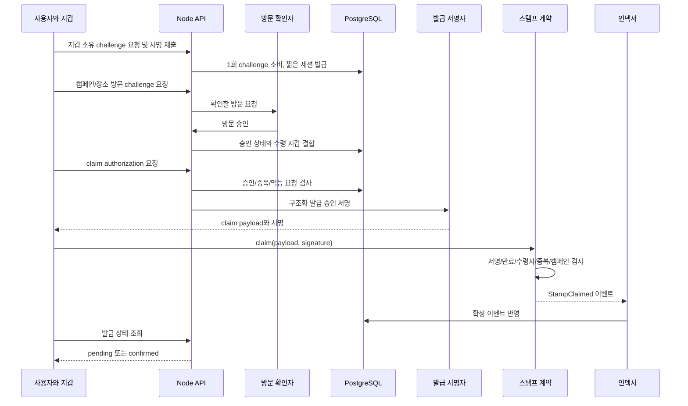

# P3. Hardhat 온체인 시스템 — 실행 계획과 아키텍처

상태: 제안 · 상위 문서: [통합 계획](README.md) · 예상: 8~12 작업일

## 1. 제품 범위와 신뢰 경계

기존 StampCollector를 실제 발급 기록에 연결하여 “승인된 방문 스탬프”를 지갑과 공개 검증 화면에서 조회하게 한다. 첫 버전은 전포 캠페인 1개와 비양도 레지스트리 계약 1개다. 토큰 매매, 결제, 쿠폰 정산, NFT 마켓 연동은 포함하지 않는다.

Hardhat은 개발·테스트·배포 도구이며 로컬 체인부터 사용한다. 공개 테스트넷 배포는 로컬 통합 검증 후의 별도 실행 단계다. [Hardhat 테스트 가이드](https://hardhat.org/docs/guides/testing/using-viem).

체인은 “허용된 서명자가 이 지갑에 발급을 승인했다”는 사실과 중복 여부를 검증한다. 실제 방문 여부는 방문 확인자/서버가 판단한다. 고정 QR이나 GPS만으로 방문을 증명한다고 설명하지 않는다. 초기 데모는 모의 방문 확인임을 화면에 표시한다.

## 2. 아키텍처와 발급 흐름



개인키는 서명 서비스 안에만 있고 브라우저에 전달하지 않는다. 공개 발급 허용 권한과 관리 권한을 별도로 둔다. 로컬 데모용 키/확인자와 공개 환경 설정을 분리하며 공개 환경에서 모의 승인 엔드포인트는 등록하지 않는다.

## 3. 계약 설계

목표 위치: chain/contracts/AlleyStampRegistry.sol.

```solidity
struct Claim {
    address recipient;
    bytes32 campaignId;
    bytes32 spotId;
    uint256 nonce;
    uint256 deadline;
}

function claim(Claim calldata approval, bytes calldata signature) external;
function hasStamp(address recipient, bytes32 campaignId, bytes32 spotId)
    external view returns (bool);
function setCampaign(bytes32 campaignId, bool active) external;
function setCampaignSpot(bytes32 campaignId, bytes32 spotId, bool allowed) external;
function setIssuer(address issuer, bool allowed) external;
function pause() external;
function unpause() external;

event StampClaimed(address indexed recipient, bytes32 indexed campaignId,
                   bytes32 indexed spotId, uint256 nonce);
```

위 코드는 ABI 설계 초안이며 구현이 아니다. 역할 변경과 캠페인/장소 변경에도 이벤트를 남긴다.

상태:

- stamps[recipient][campaignId][spotId] = 발급 여부.
- usedNonces[recipient][nonce] = 사용 여부.
- campaigns[campaignId] = 활성 여부.
- campaignSpots[campaignId][spotId] = 허용 여부.
- authorizedIssuers[issuer] = 서명 권한.
- 관리자는 캠페인/장소/서명자 설정, 긴급 관리자는 pause, 해제는 관리자만 수행하도록 역할을 구분한다.

claim 검증 순서: 일시정지 여부 → msg.sender == recipient → deadline → 캠페인/장소 허용 → 중복 스탬프/nonce → EIP-712 서명자 복구 및 권한 → 상태 갱신 → 이벤트. 외부 토큰 전송·결제·콜백은 없다.

EIP-712 domain: name=BusanAlleyStamp, version=1, chainId, verifyingContract. 구조 타입 문자열은 Claim(address recipient,bytes32 campaignId,bytes32 spotId,uint256 nonce,uint256 deadline)로 SDK와 계약에 동일하게 고정한다. [EIP-712 표준](https://eips.ethereum.org/EIPS/eip-712)은 자체적으로 재사용 방지를 제공하지 않으므로 nonce 소비와 중복 키를 계약에서 구현한다.

nonce는 서버에서 암호학적으로 생성하고 DB UNIQUE 제약으로 충돌을 감지한다. uint256은 JSON에서 십진 문자열로 전달한다. 지갑·서버·계약의 같은 입력 해시를 비교하는 fixture를 만든다. spotId와 campaignId의 문자열→bytes32 변환도 fixture로 고정한다.

## 4. 방문 승인과 발급 API

지갑 소유 확인은 서버가 발급한 1회 challenge(도메인·지갑·nonce·만료·용도)를 서명하는 방식으로 시작한다. 5분 만료와 원자적 1회 소비를 적용한다. 공개 환경에서는 검증된 지갑 인증 구현을 검토하고 인증/세션 정책을 P3-01에서 확정한다. 지갑 서명은 로그인용과 스탬프 승인용을 구분한다.

| API | 권한/입력 | 처리 |
| --- | --- | --- |
| POST /api/v1/wallet/challenges | address | nonce와 서명 메시지 발급 |
| POST /api/v1/wallet/sessions | challengeId, signature | 소유 확인 후 짧은 세션. 로그에 서명 미기록 |
| POST /api/v1/visits/challenges | 지갑 세션, campaignId, spotId | 5분 만료 방문 요청, 요청 지갑에 고정 |
| POST /api/v1/visits/:id/approve | 별도 확인자 권한 | 캠페인/장소 범위 검증 후 승인 |
| POST /api/v1/stamps/authorizations | 지갑 세션, visitId, Idempotency-Key | 방문 확인 완료 시 10분 만료 claim 서명 |
| GET /api/v1/stamps?address=... | 공개 조회 | 온체인 공개 기록, DB 인덱스 및 동기화 지연 표시 |
| GET /api/v1/stamps/status?... | 체인/계약/지갑/캠페인/장소 | 미발급/pending/confirmed 상태 |

동일 방문 요청의 재시도는 기존 서명과 payload를 반환한다. 본문을 바꿔 멱등 키를 재사용하면 409. 다른 지갑이나 미승인 방문은 거절한다. 만료된 승인을 재발급하려면 최신 체인 상태에서 미발급임을 확인하고 원래 승인된 방문 정책을 적용한다. RPC 불가 시 새 승인을 보류한다. 이미 발급된 경우에는 새 nonce를 만들지 않는다.

서버가 claim 승인 서명을 반환하는 것과 사용자의 트랜잭션 발급은 별개다. 제출 여부는 클라이언트 보고만으로 확정하지 않고 receipt/이벤트로 확인한다. 초기에는 사용자가 테스트 가스를 부담하는 직접 제출 방식으로 한정한다. relayer는 별도 범위다.

## 5. DB와 상태 머신

| 테이블 | 주요 데이터/제약 |
| --- | --- |
| wallet_challenges | challenge hash, wallet, expires_at, consumed_at; 1회 소비 |
| visit_requests | id, wallet, campaign_id, spot_id, state, expires_at, verifier_id, approved_at |
| stamp_authorizations | visit_id, recipient, chain_id, contract, nonce, deadline, payload_hash, signature, state; nonce 및 멱등 키 UNIQUE |
| chain_deployments | chain_id, contract_address, deployment_block, abi_version |
| chain_events | chain_id, contract, tx_hash, log_index, block_number, block_hash, payload, canonical; 복합 UNIQUE |
| stamp_projections | chain_id, contract, recipient, campaign_id, spot_id, claim_tx_hash; 복합 UNIQUE |
| indexer_cursors | chain_id, contract, processed_block, block_hash |

서명은 재시도 응답에 필요하므로 접근 제한 저장하며 API 로그에는 남기지 않는다. 실제 방문 확인 자료는 필요한 최소량과 짧은 보존 기간으로 별도 관리한다. 원문 위치 정보·실명·대화는 체인에 올리지 않는다.

상태는 한 필드로 섞지 않는다.

- 방문: requested → approved / rejected / expired.
- 승인: issued → expired 또는 온체인 관측 후 consumed. issued는 아직 스탬프가 아니다.
- 트랜잭션 UI: awaiting_signature → submitted → confirming → confirmed / reverted / dropped.
- 프로젝션: canonical 이벤트 기반. reorg 시 confirmed 표시를 되돌리고 재동기화한다.

사용자가 지갑/네트워크를 바꾸면 이전 지갑의 진행 상태를 새 지갑에 표시하지 않는다. pending 요청은 chainId/address/nonce로 추적하고 새로고침 후 receipt를 다시 확인한다.

## 6. 이벤트 동기화와 복구

1. deployment_block부터 시작하며 RPC 요청 블록 범위를 제한한다.
2. 체인별 confirmations 설정 이후의 이벤트를 canonical projection에 반영한다. 로컬에서는 1, 공개 테스트넷은 선택한 체인 특성에 맞춰 확정한다.
3. 이벤트 저장·projection 갱신·커서 전진을 하나의 DB transaction에서 수행한다.
4. 재시작 시 같은 구간을 읽어도 UNIQUE 제약과 upsert로 중복 발급을 만들지 않는다.
5. 최근 재조회 창의 blockHash를 확인한다. 불일치 시 마지막 공통 블록까지 되돌아가 영향받은 이벤트를 비정상으로 표시하고 projection을 재구성한다.
6. 더 깊은 재조직이나 RPC 간 불일치는 동기화를 멈추고 deployment_block부터 재구축 가능한 도구로 복구한다. 추정한 확정 상태를 보여주지 않는다.

온체인이 발급의 원본이며 DB는 조회용 사본이다. RPC 장애 때는 마지막 동기화 시각을 표시하고 확정 완료를 추정하지 않는다. 공개 검증 화면에서 네트워크/계약/트랜잭션 링크와 직접 hasStamp 조회 결과를 확인할 수 있게 한다.

## 7. 도구와 패키지 경계

- chain/ 독립 패키지: Hardhat 3, Solidity, TypeScript/viem 테스트, Ignition 모듈.
- 검증된 서명/권한/일시정지 기본 구성은 OpenZeppelin을 후보로 사용한다. 정확 버전은 P3-02에서 호환성 테스트 후 고정한다.
- Node 지원 범위는 [Hardhat 공식 문서](https://hardhat.org/docs/reference/nodejs-support)와 기존 앱 빌드 요구를 함께 확인한다.
- ABI와 배포 metadata는 생성 산출물에서 프론트엔드/API에 공급한다. 각 모듈에 계약 주소를 수동 중복 입력하지 않는다.
- 계약 업그레이드 proxy는 첫 버전에서 도입하지 않는다. 새 계약 배포 시 chain_deployments와 조회 UI가 구/신 이력을 함께 읽게 한다.

## 8. 작업 분해

| ID | 구현 대상 | 선행 | 완료 조건 | 예상 |
| --- | --- | --- | --- | --- |
| P3-01 | claim 스키마, 신뢰 경계, 방문/지갑 인증 정책 | P1 공통 ID | 서명 도메인·역할·중복 정의·모의 승인 정책 fixture | 1일 |
| P3-02 | chain 패키지, 계약, 로컬 Ignition 배포 | 01 | 정상 claim 및 hasStamp, ABI metadata 생성 | 1~2일 |
| P3-03 | 단위/경계/fuzz·가스 테스트 | 02 | 위조/재사용/권한/만료 거절, 관리자 pause 동작 | 1~2일 |
| P3-04 | 방문 승인/claim 서명 API, DB | 01, P1-06 | 미승인 거절, 동일 요청 재시도 일치, 동시 요청 검증 | 1~2일 |
| P3-05 | 지갑·StampCollector·검증 UI | 02/04 | 네트워크/서명 거절/pending/revert/복원 처리 | 1~2일 |
| P3-06 | jobs/chain-indexer 및 projection | 02, P1-06 | 중복 수집·재시작·reorg 복구 | 2일 |
| P3-07 | 로컬 통합, 배포 모듈 및 테스트넷 실행 안내 | 03/05/06 | end-to-end 재현, 가스/신뢰 경계 보고서 | 1일 |

합계 8~12일은 로컬 통합 기준이다. 공개 테스트넷 실제 배포 및 운영 방문 확인 연결의 대기 시간은 포함하지 않는다.

## 9. 검증 매트릭스와 완료 기준

| 시나리오 | 기대 결과 |
| --- | --- |
| 승인된 방문, 올바른 지갑/계약/체인/만료 | 정확히 1회 발급 및 이벤트 |
| recipient/campaign/spot/nonce/deadline 변조 | 서명 검증 실패 |
| 같은 서명 재사용, 새 nonce로 동일 장소 재발급 | nonce 또는 스탬프 중복으로 거절 |
| 다른 체인/계약에서 사용 | domain 불일치로 거절 |
| 제3자가 서명을 복사하여 제출 | msg.sender 검사로 거절 |
| deadline 직전/같은 시각/직후 | 계약의 경계 정책대로 허용/허용/거절 |
| 비활성 캠페인/미등록 장소/폐기된 서명자 | 거절 |
| 권한 없는 설정 변경, pause 중 claim | 거절 |
| API 미승인 방문, 다른 지갑 세션 | 서명 미발급 |
| 동시 claim 두 개 | 온체인 상태는 최대 1회만 변경 |
| 이벤트 재수집, 프로세스 중단 후 재시작 | projection 중복 없이 복구 |
| 로컬 블록 되돌림과 다른 블록 재생성 | 이전 확정 표시 취소 후 canonical 상태 반영 |

property 테스트는 항상 recipient/campaign/spot당 최대 하나의 스탬프, 허용되지 않은 서명자의 상태 변경 불가를 검증한다. 가스는 claim/관리/실패 경로를 구분하여 baseline과 비교하며 거래 비용 금액은 당시 테스트넷/체인 수수료와 구분한다.

최종 데모: 모의 방문 승인 → 지갑 발급 → 중복 시도 거절 → 새로고침 → 공개 검증 → DB projection 비우기 대신 별도 테스트 DB에서 재구축하여 동일 결과 확인. 기존 일반 플래너는 지갑 없이도 동작한다.

## 10. 롤아웃과 운영 실패

로컬 → 공개 테스트넷 순으로 진행한다. 공개 화면은 네트워크와 데모 스탬프임을 명확히 표시한다. 발급 기능 장애 시 패스를 읽기 전용으로 전환하고 기본 여행 기능은 유지한다.

서명자 문제는 권한 폐기와 발급 pause로 대응하고 미소비 서명을 재발급한다. 이미 확정된 스탬프를 삭제하거나 현실 방문을 보증한다고 주장하지 않는다. 초기 계약에 발급 취소 기능이 필요하면 제품 정책을 별도로 설계하고 테스트한 뒤 추가한다.

산출물: 계약/ABI/배포 모듈, 서명 공통 fixture, 검증 보고서, gas snapshot, 이벤트 재구축 도구, 공개 검증 UI, 로컬 실행 및 테스트넷 배포 안내.
