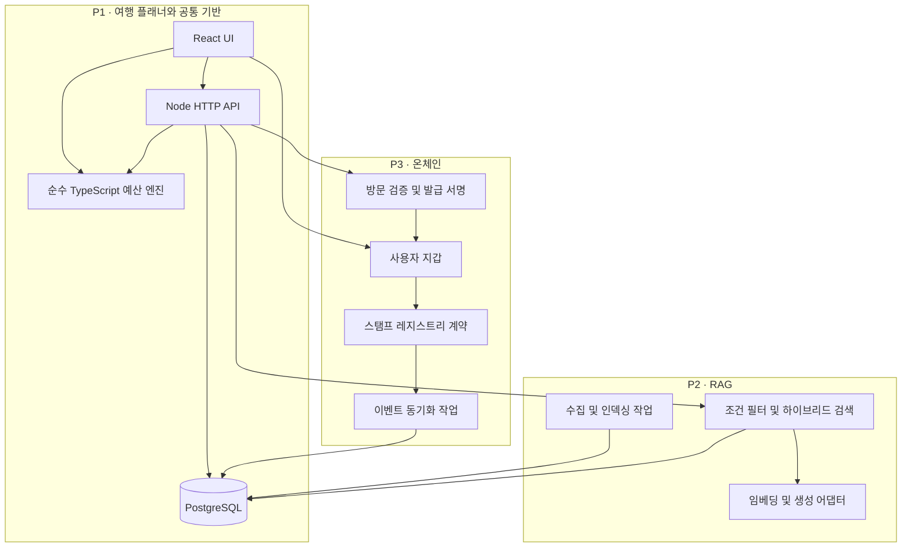
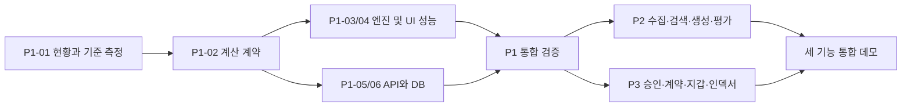

# 고도화 실행 계획 — 세 개의 프로젝트 단위

작성일: 2026-09-23 · 상태: 구현을 위한 설계 초안 · 기준: 현재 체크아웃 코드 정적 검토

이 문서는 [고도화 전략](../upgrade-strategy.md)을 실행 가능한 세 단위로 분해한다. 아래 경로·API·테이블·명령은 목표 구조이며, 아직 생성하거나 구현한 것으로 해석하지 않는다. 이 계획의 단위는 동일 저장소 안의 Epic이며 저장소를 세 개로 분리하지 않는다.

역할별 실행 지시서는 [4개 에이전트 YAML 프롬프트](../../prompts/upgrade-agents/README.md)를 사용한다. 총괄·QA, 성능·프론트엔드, 백엔드·RAG, 온체인으로 나누며 원래 20개 작업을 병렬 인계용 27개 실행 항목으로 배치한다. 이 4개 파일의 할당·의존 관계가 실제 실행 순서를 구체화하며, 아래 상세 문서의 제품 완료 기준은 그대로 유지한다.

| 단위 | 사용자에게 제공하는 결과 | 책임 | 상세 설계 |
| --- | --- | --- | --- |
| P1. 시스템 성능 개선 | 빠르고 정확하며 저장이 유지되는 여행 플래너 | 예산 엔진, UI 성능, API/DB 공통 기반 | [P1 상세](01-system-performance.md) |
| P2. RAG 시스템 | 자연어로 조건을 입력하고 출처와 함께 코스 추천 받기 | 데이터 수집, 검색, 생성, 품질 평가 | [P2 상세](02-rag-system.md) |
| P3. Hardhat 온체인 시스템 | 승인된 방문 스탬프 발급과 공개 검증 | 방문 승인, 계약, 지갑, 이벤트 동기화 | [P3 상세](03-onchain-system.md) |

## 1. 통합 아키텍처



프론트엔드와 API를 하나의 코드 저장소에서 관리하고, 실행 프로세스는 웹/API/작업 프로세스/로컬 체인으로 나눈다. 수집과 인덱서는 API 요청의 생명주기에 묶지 않는다. 초기부터 마이크로서비스로 분리하지 않는다.

## 2. 목표 폴더와 의존 규칙

```text
src/
  App.tsx, components/, styles/     기존 UI 점진 개선
  domain/                          P1: 타입·가격·예산 탐색·검증
  services/                        브라우저 API/지갑 어댑터
  server/
    controllers/                   HTTP 요청/응답 매핑
    application/                   plans/, rag/, stamps/ 유스케이스
    repositories/                  저장소 인터페이스와 PostgreSQL 구현
    providers/                     모델·RPC·서명 어댑터
  workers/                         필요성이 입증된 브라우저 Worker
jobs/
  ingest/                          P2 수집/청킹/임베딩
  chain-indexer/                   P3 이벤트 동기화
db/migrations/                     P1/P2/P3 순차 migration
chain/                             별도 package.json/lockfile/tsconfig
  contracts/, test/, ignition/
  deployments/                     체인 ID·주소·시작 블록·ABI 식별자
evals/rag/                         검수된 질문·정답 근거·평가 실행
benchmarks/                        입력 fixture·성능 측정·결과
docs/reports/                      실제 검증 결과
```

- domain은 React, DB, 모델 SDK, 지갑 SDK에 의존하지 않는다.
- controllers는 application을 호출하며 직접 SQL이나 모델 호출을 하지 않는다.
- application은 repository/provider 인터페이스를 이용한다. 테스트에서는 대체 구현을 주입한다.
- 브라우저 번들에는 서버 키·서명 모듈·DB 클라이언트를 포함하지 않는다. 공통 DTO는 서버 구현에서 분리한다.
- 기존 src/services/budgetCalculator.ts는 도메인 모듈로 옮기는 동안 호환 facade 역할을 한다.
- 루트와 chain 패키지의 타입 검사/테스트를 분리한다. Node 버전은 Hardhat과 기존 Vite 호환성을 확인해 고정한다.

## 3. 세 단위를 연결하는 공통 계약

| 계약 | 규칙 | 소유 단위 |
| --- | --- | --- |
| spotId | 기존 장소 ID를 유지. 이름 변경으로 ID 변경 금지. 비활성화는 soft-delete | P1 |
| catalogVersion | 가격/장소 스냅샷 버전. 엔진 입력·계획·RAG 응답에 포함 | P1 |
| budgetKRW | 모든 여행자 합계, 0 이상 안전한 정수. 입력 허용 범위는 P1에 명시 | P1 |
| money | 원 단위 정수 계산, 실제 결제 가격이 아닌 검수된 예상 비용 | P1 |
| schemaVersion | 새 계획은 2. 기존 저장 데이터는 명시적 변환 및 검증 | P1 |
| requestId | API 응답과 로그에서 같은 ID로 추적 | P1 |
| corpusVersion | 활성 문서/청크 집합 버전. catalogVersion과 별도로 관리 | P2 |
| campaignId | 온체인 발급 정책의 식별자. 장소 및 카탈로그 버전과 독립 | P3 |
| chainSpotId | keccak256(UTF-8로 인코딩한 정규 spotId). 변환 fixture를 공유 | P3 |

핵심 함수 제안:

```ts
type PlanningResult =
  | { status: 'ok'; plan: PlanV2; diagnostics: PlanningDiagnostics }
  | { status: 'infeasible'; reason: string; minimumRequiredKRW?: number }
  | { status: 'invalid'; fields: Record<string, string> };

// 동일 입력과 버전에 대해 동일한 장소·합계. ID와 생성 시각은 외부에서 부여한다.
buildPlan(input: PlannerInput, catalog: CatalogSnapshot): PlanningResult;
```

RAG가 후보를 좁힌 결과의 불가능 상태는 전체 카탈로그에 해가 없다는 의미가 아니다. 후보 확대 재시도 또는 기본 플래너 fallback을 명시한다. 후보 축소 상태의 minimumRequiredKRW는 해당 후보 집합에 대한 값이라고 표시한다.

API 공통 응답은 성공 시 data와 requestId, 실패 시 error.code/error.message/requestId를 사용한다. 400=형식 오류, 404=없음, 409=버전/중복 충돌, 422=처리할 수 없는 조건, 429=제한, 503=의존 서비스 일시 장애로 구분한다. RAG의 근거 부족/질문 필요는 정상적인 응답 상태다.

기존 /api/plans 등은 P1에서 호환 어댑터를 유지하고 새 계약은 /api/v1으로 제공한다. 프론트엔드 이전 완료 전 구형 응답 필드를 갑자기 제거하지 않는다.

## 4. 실행 순서와 의존성



개인 개발 기본 순서는 P1 → P2 → P3이다. P3 계약 단위 테스트는 P2 완료 전에도 독립적으로 진행할 수 있다. 이 설명은 작업 의존 관계이며 자동으로 병렬 에이전트를 실행한다는 뜻은 아니다.

| 순서 | 예상 작업일 | 종료 게이트 |
| --- | --- | --- |
| P1 | 10~14일 | 정확성·성능 보고서, 공유 복원, 독립 API 실행 |
| P2 | 8~12일 | 전포 corpus, 인용 있는 추천, 고정 평가셋 결과 |
| P3 | 8~12일 | 로컬 발급과 중복 방지, 지갑 UI, 이벤트 복원 |
| 합계 | 26~38일 | 각 단위 검증 및 최종 통합 시나리오 포함 |

기존 전략의 21~34일보다 방문 승인/데이터 계약/장애 복구를 상세화하여 재산정했다. 한 명의 집중 작업 기준 추정이며 모델 제공업체 준비, 관광 자료 이용 조건 확인, 테스트넷 대기·운영 배포는 별도다. 병렬 작업 시 단순히 기간을 3으로 나누지 않는다.

## 5. 공통 품질 게이트와 운영

- 각 상세 문서의 작업 표를 Issue/작업 브랜치 단위로 사용한다. 순수 리팩터링과 정책 변경은 별도 변경으로 검토한다.
- 모든 수치는 목표다. 실제 리포트는 commit/runtime/fixture/version을 함께 기록한다.
- P1: domain/API 테스트와 프로덕션 빌드, 지정 조건의 benchmark.
- P2: 오프라인 고정 평가셋 및 별도 실제 모델 평가. 일상 CI는 네트워크에 의존하지 않게 한다.
- P3: 로컬 체인 단위/통합 테스트와 가스 스냅샷. 공개 테스트넷은 별도의 재현 기록으로 남긴다.
- 통합: 일반 계획 생성 → RAG 추천 적용 → 저장/공유 → 모의 방문 승인 → 발급 → 페이지 재접속 → 검증 화면.
- 장애 통합: 모델 중단 시 기본 플래너 사용, RPC 중단 시 발급 상태 보류, DB 중단 시 저장 성공 표시 금지.
- 로컬은 PostgreSQL(pgvector 지원)와 Hardhat을 사용한다. 공개 데모는 정적 웹 + 별도 API/작업 프로세스 + DB + EVM 테스트넷 구성을 제안한다.
- 지표: 요청 p95/실패율, DB 지연, RAG 비용/근거 부족률, 발급 실패/확정 대기/인덱서 지연. 로그에는 질문 전문·서명·개인키를 기본 기록하지 않는다.
- DB migration은 확장 → backfill → 읽기 전환 순서로 한다. 구형 데이터를 즉시 제거하지 않는다. RAG corpus는 이전 버전 포인터로 되돌릴 수 있게 한다.
- 온체인 확정 기록은 웹 배포처럼 되돌릴 수 없다. 발급 일시정지·새 계약 배포·주소별 이력 병합으로 복구한다.

## 6. 설계 선택과 구현 전에 확정할 항목

현재 제안: React/Vite 유지, 기존 Node API 확장, PostgreSQL + pgvector, Hardhat 3 + viem, 비양도 스탬프 레지스트리. 제공업체 계약이나 패키지 설치는 아직 수행하지 않았다.

구현 시 결정할 항목은 담당 작업에 연결한다: 가격·인원 정책(P1-02), DB 실행 환경(P1-06), 임베딩/생성 모델과 요청 비용 한도(P2-02), 실제 방문 확인 운영자 및 지갑 인증 정책(P3-01), 공개 테스트넷/RPC(P3-07). 로컬 검증에는 외부 유료 서비스나 실매장 운영이 필수는 아니다.

## 7. 이번 구체화의 완료 상태

- 세 단위의 아키텍처·입출력·데이터 모델·작업 순서·완료 기준 문서화.
- 기능 구현/패키지 추가/GitHub Issue 생성/배포는 미수행.
- 다음 착수 작업: P1-01. 현재 테스트·빌드와 프로파일링을 실행해 baseline 보고서를 만든다.
