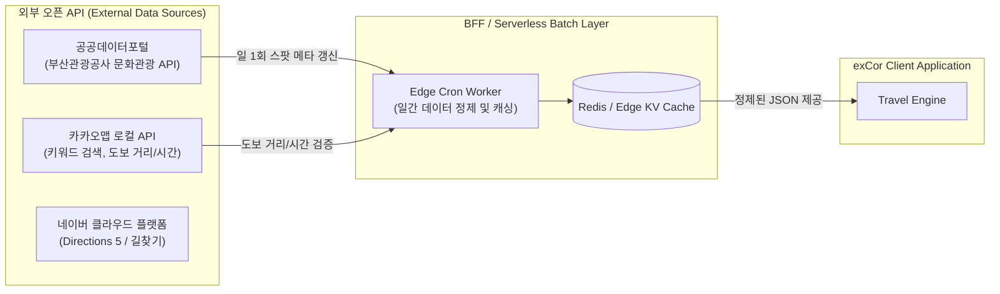
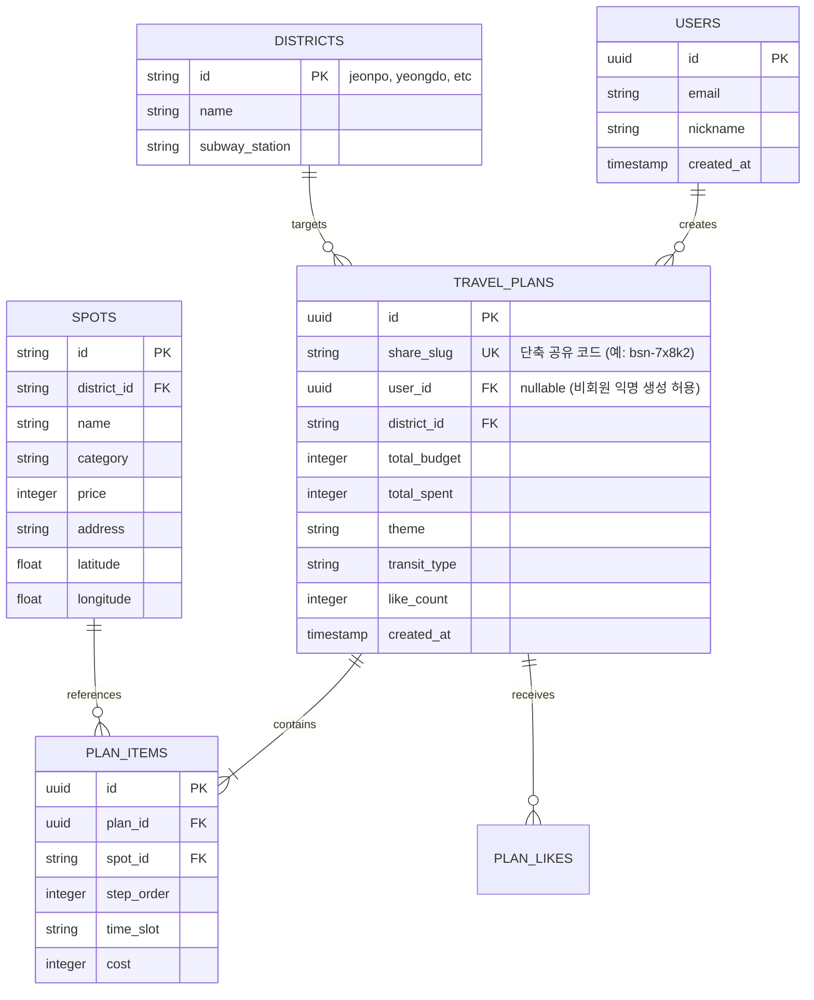

# [Roadmap & Integration] Phase 2 확장 및 외부 연동 설계서

> **문서 버전**: v1.0.0  
> **상태**: 계획됨 (Draft / Proposed for Phase 2)  
> **작성자 / 역할**: Architect Agent & DevOps Agent  
> **최종 수정일**: 2026-09-16  

---

## 1. 개요 및 확장 방향

`부산 골목 밸런서 MVP`는 정적 카탈로그(`busanAlleys.ts`)와 클라이언트 인메모리 연산을 통해 빠른 출시와 무중단 사용자 경험을 확보했습니다.

Phase 2에서는 다음 세 가지 핵심 영역으로 시스템을 확장합니다:
1. **외부 오픈 API 연동**: 공공데이터포털의 부산 문화관광 데이터 및 실시간 영업정보/축제 연동
2. **지도 플랫폼 SDK 통합**: 네이버/카카오 지도 도보 경로 탐색 및 정확한 이동 소요 시간 제공
3. **백엔드 영속성 및 공유 플랫폼**: 나만의 코스 저장, 커뮤니티 코스 랭킹, UUID 단축 URL 공유 지원

---

## 2. 외부 데이터 연동 아키텍처



### 2.1 공공데이터포털 (부산관광공사) API 연동 스키마
- **데이터셋**: 부산광역시_문화관광 해설 및 축제/명소 정보
- **수집 데이터 항목**:
  - `UC_SEQ`: 고유 관광지 코드
  - `MAIN_TITLE`: 스팟 명칭
  - `GUGUN_NM`: 부산 자치구 (부산진구 -> 전포, 영도구 -> 영도, 해운대구 -> 해리단길 등)
  - `LAT`, `LNG`: WGS84 위경도 좌표
  - `USAGE_AMOUNT`: 입장료 및 이용 금액 정보
  - `MIDDLE_SIZE_RM`: 테마/카테고리 분류

---

## 3. 백엔드 영속성 및 DB 스키마 설계 (Phase 2 Backend)

여행 일정 저장, 좋아요, 단축 링크 공유를 위한 경량 서버리스 백엔드(Supabase / PostgreSQL) 데이터 모델입니다.



### 3.1 REST API 엔드포인트 명세 초안

| Method | Endpoint | Description | Auth |
|---|---|---|---|
| `POST` | `/api/v1/plans` | 신규 생성된 코스 저장 및 `share_slug` 단축 URL 발급 | Optional (익명 허용) |
| `GET` | `/api/v1/plans/:slug` | 단축 URL 코드로 저장된 여행 일정 조회 | Public |
| `POST` | `/api/v1/plans/:slug/like` | 추천 코스 좋아요 증감 | Public (IP 제한) |
| `GET` | `/api/v1/curations/popular` | 예산대별 가장 인기 있는 골목 코스 랭킹 목록 | Public |

---

## 4. 모바일 네이티브 딥링크 및 지도 연동 고도화

### 4.1 현재 MVP 방식 (Web URL Fallback)
- 네이버 지도: `https://map.naver.com/v5/search/{encodedSpotName}`
- 카카오 지도: `https://map.kakao.com/link/search/{encodedSpotName}`

### 4.2 Phase 2 Native Deep-link 개선
모바일 기기 접속 시 설치된 네이티브 지도 앱을 우선 실행하고, 미설치 시 웹으로 Fallback하는 Universal Link / App Link 체계 적용:
```typescript
export function openMapApp(spot: Spot, provider: 'kakao' | 'naver') {
  const isMobile = /Android|iPhone|iPad/i.test(navigator.userAgent);
  if (provider === 'kakao') {
    const appUrl = `kakaomap://search?q=${encodeURIComponent(spot.name)}`;
    const webUrl = spot.kakaoSearchUrl;
    if (isMobile) {
      window.location.href = appUrl;
      setTimeout(() => { window.location.href = webUrl; }, 1200);
      return;
    }
    window.open(webUrl, '_blank');
  }
}
```

---

## 5. 단계별 마일스톤 및 릴리스 계획

| 마일스톤 | 핵심 목표 | 소요 기간 (예상) |
|---|---|---|
| **Phase 1 (현 MVP)** | 5대 권역 큐레이션, 3대 비용 밸런서 엔진, 스팟 교체, 클립보드 공유 | 완료 |
| **Phase 2-A** | 백엔드 저장소(Supabase) 연동, UUID 단축 링크 및 카카오톡 공유 메시지 템플릿 연동 | 2주 |
| **Phase 2-B** | 카카오 로컬 API 연동으로 실제 도보 이동 거리 및 분 단위 소요 시간 자동 계산 | 2주 |
| **Phase 2-C** | 사용자 코스 커뮤니티 탭 및 테마별 '명예 부산 가이드' 인기 코스 피드 오픈 | 3주 |
