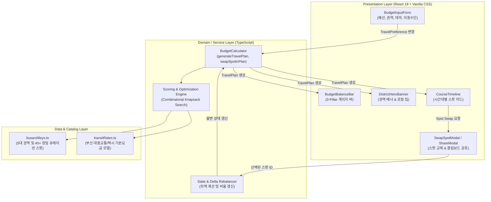
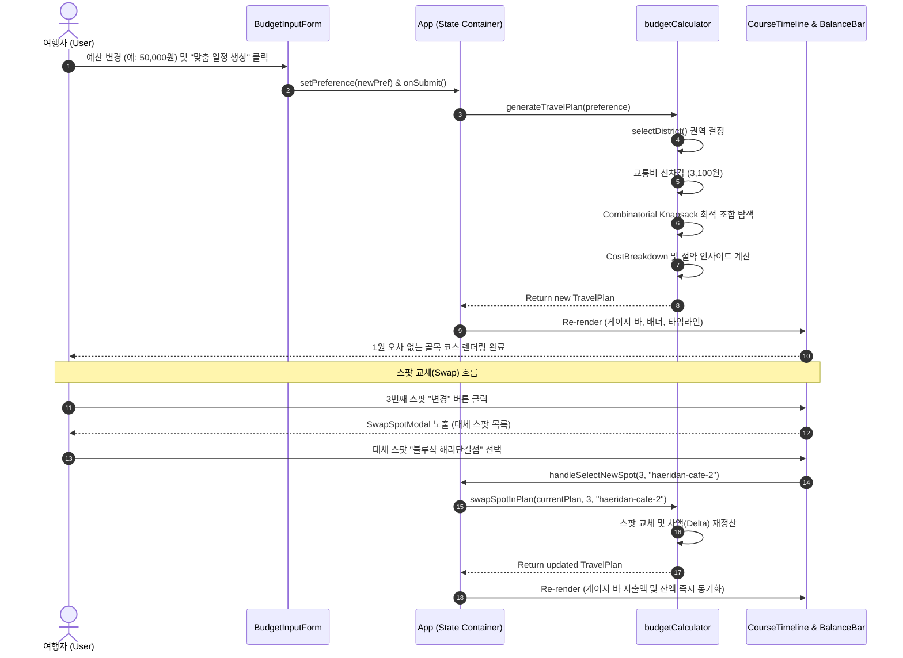

# [Architecture] 부산 골목 밸런서 시스템 아키텍처 및 데이터 흐름 설계서

> **문서 버전**: v1.0.0  
> **상태**: 승인됨 (Approved)  
> **작성자 / 역할**: Architect Agent & Team  
> **최종 수정일**: 2026-09-16  

---

## 1. 아키텍처 개요 (System Overview)

`exCor (부산 골목 밸런서)`는 사용자의 예산 입력에 따라 즉각적인 피드백을 제공해야 하는 여행 플래너입니다. 불필요한 백엔드 API 호출 지연을 없애고 오프라인 또는 이동 중에도 원활히 동작할 수 있도록 **Client-Side Optimized Architecture (클라이언트 주도 최적화 아키텍처)**를 채택하고 있습니다.



---

## 2. 계층별 상세 설계 (Layered Architecture Details)

### 2.1 Presentation Layer (뷰 계층)
- **책임**: 반응형 모바일/데스크톱 UI 렌더링, 사용자 인터랙션 처리, 마이크로 애니메이션 제공
- **주요 컴포넌트**:
  - `Header`: 서비스 아이덴티티 및 슬로건 표시
  - `BudgetInputForm`: 예산 슬라이더(2만~10만원), 권역(District), 테마(Theme), 이동수단(Transit) 설정 인터페이스
  - `BudgetBalanceBar`: 3-Pillar(교통, 식음료, 입장료, 비상금) 프로그레스 게이지 및 예산 인사이트 배너
  - `DistrictHeroBanner`: 선택된 골목의 대표 분위기, 권역 뱃지, 지하철역 및 현지인 비밀 꿀팁 안내
  - `CourseTimeline`: 11:00부터 17:00까지 순차적 타임라인 아이템(`SpotCard`) 렌더링
  - `SwapSpotModal`: 코스 내 특정 스팟을 동일 권역/카테고리의 대체 스팟으로 즉시 교체
  - `ShareModal`: 네이티브 공유 API 및 텍스트 클립보드 복사 처리

### 2.2 Service Layer (도메인/계산 계층)
- **책임**: 예산 분배 알고리즘 실행, 코스 생성, 스팟 변경 시 비용 무결성 보장
- **핵심 모듈 (`src/services/budgetCalculator.ts`)**:
  - `generateTravelPlan(preference: TravelPreference): TravelPlan`
    - 입력된 조건에 따라 권역을 확정하고 최적의 스팟 조합을 탐색하여 불변 객체 `TravelPlan`을 반환
  - `swapSpotInPlan(plan: TravelPlan, itemOrder: number, newSpotId: string): TravelPlan`
    - 특정 순서의 스팟을 교체하고, 전체 합계(`totalSpent`), 잔여액(`remainingBudget`), 카테고리별 점유율(`CostBreakdown`)을 순수 함수 방식으로 재정산
  - `selectDistrict(preference: TravelPreference): AlleyDistrict`
    - 사용자가 권역을 직접 선택하지 않은 경우(all), 예산 범위와 테마에 가장 적합한 최적 권역을 결정

### 2.3 Data Layer (데이터/카탈로그 계층)
- **책임**: 부산 5대 골목상권 메타데이터 및 실제 스팟의 가격, 메뉴, 주소, 지도 검색 URL 제공
- **데이터 소스 (`src/data/`)**:
  - `ALLEY_DISTRICTS`: 전포(`jeonpo`), 영도(`yeongdo`), 해리단길(`haeridan`), 보수동(`bosu`), 망미단길(`mangmi`)
  - `SPOTS_DATA`: 음식점(`food`), 카페(`cafe`), 입장/체험(`admission`), 간식(`snack`) 카테고리별 상세 정보
  - `TRANSIT_COST_MODELS`: 대중교통+도보(`transit_walk`, 3,100원), 택시(`comfort_taxi`, 9,000원)

---

## 3. 엔드투엔드 데이터 흐름 (Data Flow Lifecycle)



---

## 4. 핵심 데이터 모델 인터페이스 (Core Domain Types)

```typescript
// 카테고리 및 도메인 식별자
export type SpotCategory = 'transit' | 'food' | 'cafe' | 'admission' | 'snack';
export type DistrictId = 'jeonpo' | 'yeongdo' | 'haeridan' | 'bosu' | 'mangmi';
export type TravelTheme = 'all' | 'cafe_dessert' | 'local_food' | 'retro_culture' | 'ocean_healing';
export type TransitType = 'transit_walk' | 'comfort_taxi';

// 장소 정보
export interface Spot {
  id: string;
  districtId: DistrictId;
  name: string;
  category: SpotCategory;
  price: number; // 1인 기준 평균 지출액 (원)
  estimatedTimeMinutes: number;
  summary: string;
  signature: string; // 대표 메뉴 / 핵심 체험
  tags: string[];
  address: string;
  naverSearchUrl: string;
  kakaoSearchUrl: string;
  tip?: string;
  isFree?: boolean;
}

// 3대 비용 산출 결과
export interface CostBreakdown {
  transitCost: number;       // 교통비
  foodCost: number;          // 식비 + 카페
  admissionCost: number;     // 입장료 + 체험
  snackBufferCost: number;   // 간식 / 비상금
  totalSpent: number;        // 총 지출액
  remainingBudget: number;   // 예산 잔액
  transitPercent: number;    // %
  foodPercent: number;       // %
  admissionPercent: number;  // %
  bufferPercent: number;     // %
}

// 완성된 일정 객체
export interface TravelPlan {
  id: string;
  title: string;
  district: AlleyDistrict;
  preference: TravelPreference;
  costBreakdown: CostBreakdown;
  items: CourseItem[];
  alleyLocalSecretTip: string;
  savingsInsight: string;
}
```

---

## 5. 예외 및 실패 처리 전략 (Fault Tolerance & Edge Cases)

1. **초저예산 입력 (Boundary Value: 20,000원 이하)**:
   - 사용자가 20,000원을 입력하여 일반 식당+유료 체험 조합이 불가능할 경우, 시스템은 크래시 없이 `isFree: true`인 무료 공공 스팟(절영해안터널, 보수동 책방골목 산책로, F1963 도서관 등)과 가장 저렴한 가성비 노포 식당을 조합하여 안전 Fallback을 수행합니다.
2. **권역 내 스팟 부족 시 안전 가드**:
   - 특정 카테고리의 대체 스팟이 0개일 경우, UI의 Swap 모달에 빈 상태(Empty State)를 안전하게 표시하고 기존 코스를 유지합니다.
3. **불변 상태 관리**:
   - 모든 상태 변경은 원본 객체를 직접 변경(Mutate)하지 않고 스프레드 연산자(`{ ...plan }`)를 통해 새로운 불변 객체로 생성하여 React의 렌더링 누락 및 메모리 누수를 방지합니다.
