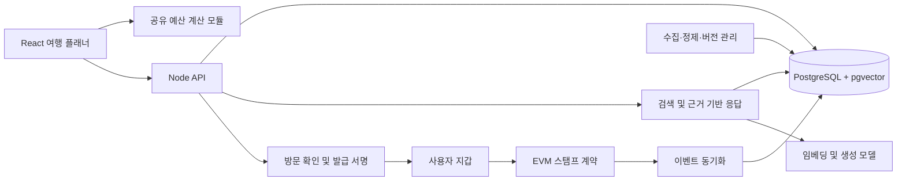

# 부산 골목 밸런서 고도화 전략

- 작성일: 2026-09-23
- 상태: 제안 초안. 현재 요청은 전략 수립이며 구현·서비스 계약·배포 결정은 포함하지 않는다.
- 목표: 빠른 예산 계산, 출처가 있는 AI 여행 추천, 검증 가능한 온체인 여행 스탬프를 하나의 제품 경험으로 연결한다.
- 진행 순서: 현재 동작 검증 → 성능 개선 → 데이터/API 기반 → RAG → 온체인 패스 → 통합 데모.

후속 구체화: [세 단위 실행 계획 및 아키텍처](implementation/README.md). API·데이터 계약·작업 분해·검증 기준은 상세 계획을 참조한다. 상세화한 예상 기간은 26~38 작업일로 아래 초기 추정을 갱신한다.

## 1. 현재 코드에서 확인한 출발점

| 영역 | 확인한 구현 | 고도화에 주는 의미 |
| --- | --- | --- |
| 프론트엔드 | React 18 + TypeScript + Vite, 4개 탭을 App.tsx에서 정적 import | 초기 번들과 탭별 렌더링을 측정하고 분리할 수 있다. |
| 코스 엔진 | budgetCalculator.ts에서 음식·카페·체험·간식의 중첩 반복 탐색 | 후보 수 증가 시 조합 수가 곱셈으로 늘어난다. 현재 느리다는 실측 결과는 아직 없다. |
| 입력 처리 | 조건 변경마다 코스 생성, 저장 처리, confetti 실행 | 입력 중 계산과 확정 후 부수 효과를 분리할 여지가 있다. |
| 정확성 | partySize가 계산에 반영되지 않으며, 최저가 fallback도 예산을 넘을 수 있음 | 성능 개선 전에 예산의 인당/전체 의미와 초과 예산 처리 계약을 정해야 한다. |
| API | Node HTTP 서버 및 Vite 개발 미들웨어 존재 | 백엔드를 처음부터 재작성하기보다 독립 실행·빌드·배포 경계를 정리한다. |
| 저장 | 서버 Map 저장소, 브라우저 localStorage | 서버 재시작 후 공유 코스를 유지할 영속 저장이 필요하다. |
| 공유 실패 | API 실패 시 저장 없이 local-* 슬러그를 생성하여 success 반환 | 실제로 복원할 수 없는 공유 링크를 성공으로 표시하는 흐름을 먼저 수정한다. |
| 여행 스탬프 | StampCollector의 초기 샘플과 useState로 수집 상태 변경 | 실제 방문 확인과 발급 이력은 새로 설계해야 한다. |

근거 파일: src/App.tsx, src/services/budgetCalculator.ts, src/services/planApi.ts, src/server/storage/planStorage.ts, src/components/pass/StampCollector.tsx, vite.config.ts, package.json.

이 문서는 코드 정적 검토 결과다. 빌드·테스트·브라우저 프로파일링 결과나 개선 수치를 주장하지 않는다. 기존 아키텍처 문서의 계획과 구현 상태를 구분한다.

## 2. 제품 시나리오와 시스템 경계

예: 사용자가 “2명이 총 7만 원으로 전포에서 조용한 카페와 로컬 맛집을 가고 싶어”라고 입력한다.

1. 자연어 조건을 구조화하고 예산이 전체 금액인지 확인한다.
2. RAG가 출처 문서에서 조건에 맞는 장소 후보와 추천 근거를 찾는다.
3. 예산 엔진이 인원·비용 규칙을 적용하여 실행 가능한 코스를 만든다.
4. 사용자는 장소 교체와 예산 변경을 즉시 반영하며 출처·확인일을 볼 수 있다.
5. 방문 확인을 마친 사용자는 원하는 경우 지갑을 연결하여 온체인 스탬프를 받는다.

예산의 최종 합계는 검증 가능한 계산 코드가 결정한다. LLM은 조건 해석·검색·설명을 담당한다. 지갑 없이도 여행 계획과 RAG를 사용할 수 있게 한다.

Hardhat은 체인 자체가 아니라 계약 개발·테스트·배포 도구다. 로컬 Hardhat 네트워크로 시작하고 공개 데모에 사용할 EVM 테스트넷은 구현 시 지원 상태·RPC·탐색기를 확인하여 결정한다.

GitHub 프로필에 핀된 저장소라는 사실과 웹사이트의 호스팅 방식은 별개다. GitHub Pages 같은 정적 호스팅을 사용한다면 API·DB·수집 작업은 별도 실행 환경이 필요하다. 현재 Vite 개발 미들웨어가 정적 배포에서도 실행된다고 가정하지 않는다.

## 3. 방향 A — 시스템 성능과 신뢰성

### A1. 먼저 측정 가능한 기준 만들기

- 프로덕션 빌드의 초기 JS gzip 크기, 주요 탭 진입 시간, React 렌더 횟수, Long Task를 기록한다.
- 코스 생성·장소 교체의 p50/p95와 실행 환경을 기록한다.
- 현재 데이터 및 1천/1만 장소의 결정적 합성 데이터를 사용한다. 전체 개수와 권역·카테고리별 분포, 실제 탐색 조합 수를 함께 기록한다.
- 확대 데이터는 제한 시간 안에서 실행하고 시간 초과도 결과로 남긴다. 기존 완전 탐색의 무제한 실행은 피한다.
- 기기·브라우저·CPU/네트워크 조건·warm-up·반복 횟수·커밋을 고정하여 전후를 비교한다.

### A2. 우선 적용할 개선

1. 입력 중 상태와 확정된 여행 조건을 분리한다. 슬라이더 계산은 적절히 묶고, 저장·축하 효과는 명시적인 확정 시점에 실행한다.
2. 비활성 탭, 지도 모달, 지갑 모듈과 축하 효과를 필요할 때 로드한다.
3. 장소를 권역·카테고리·ID로 인덱싱하여 반복 filter를 줄인다.
4. 부분 합계가 예산을 넘으면 가지치기한다. 동일 입력·카탈로그 버전의 계산 결과를 제한된 캐시에 보관한다. 캐시에 계획 ID·생성 시각을 그대로 재사용하지 않는다.
5. 확대 데이터에서 병목이 남으면 후보 축소와 Worker를 비교한다. Worker는 UI 정지를 줄이지만 알고리즘의 계산량 자체는 줄이지 않는다.
6. 후보 축소는 최적해를 놓칠 수 있으므로 작은 데이터의 완전 탐색 결과와 점수 차이·예산 준수율을 비교한다.
7. API 영속 저장과 실패 상태를 정리한다. 재시작 후 공유 링크 복원, 유효성 검증, 페이지네이션, 조회 인덱스를 추가한다.

원 단위 정수 연산, 인원 수·택시의 공동 비용 규칙, 빈 카테고리, 음수/비정상 예산, 예산 내 코스가 없는 경우를 명시한다. 최적화 과정에서 결과가 바뀌면 의도한 정책 변경인지 회귀인지 구분한다.

### A3. 제안 완료 기준

| 지표 | 제안 목표 | 검증 조건 |
| --- | --- | --- |
| 사용자 경험 | LCP ≤ 2.5초, INP ≤ 200ms, CLS ≤ 0.1 | 실제 방문 p75 기준. 초기에는 별도 실험실 측정으로 표시 |
| 코스 생성 | 1천 장소에서 p95 ≤ 100ms | 고정한 기준 기기와 데이터 분포, 목표 타당성은 baseline 후 재검토 |
| 초기 JS | baseline 대비 25% 축소 시도 | 이미 작은 경우 절대 크기와 사용자 경험을 기준으로 판단 |
| 공유 복원 | 서버 재시작 후에도 동일 코스 조회 | 실제 영속 저장소를 이용한 통합 테스트 |
| 계산 무결성 | 합계 일치, 가능한 해의 예산 준수, 불가능 상태 명시 | 경계값 및 속성 기반 테스트 |

Web Vitals 기준은 [공식 설명](https://web.dev/articles/vitals)을 참고한다. 다른 수치는 프로젝트의 제안 목표이며 달성 수치가 아니다.

## 4. 방향 B — 부산 골목 도메인 RAG

### B1. 첫 기능 범위

- 자연어 조건으로 장소와 코스 후보 찾기.
- “왜 이 장소인가”, “비 오는 날 대안은”, “저렴한 대체 장소는”에 출처를 붙여 답하기.
- 근거가 없거나 최신 영업 상태를 확인할 수 없으면 확인 불가를 표시하기.

### B2. 데이터 및 검색 설계

- 초기 corpus: 현재 큐레이션 데이터와 이용 조건을 확인한 공식 관광 자료. 상업 리뷰 대량 수집은 첫 범위에서 제외한다.
- 장소의 가격·권역·좌표·카테고리는 구조화된 필드에 저장하고, 설명·특징·이용 안내는 검색 문서로 저장한다.
- 모든 문서에 sourceUrl, publishedAt(있는 경우), fetchedAt, verifiedAt(검수한 경우), contentHash, spotId, 문서 버전을 둔다. 수집일을 사실 확인일로 취급하지 않는다.
- 문서의 제목/섹션과 장소 경계를 보존해 청크를 나눈다. 청크 크기와 top-k는 평가로 결정한다.
- SQL 조건 필터 → 키워드 및 벡터 검색 → 순위 결합 → 필요할 때 reranker → 근거 문서와 응답 생성 순으로 구성한다.
- 초기 제안은 PostgreSQL + pgvector다. 저장과 벡터 검색을 한 DB에서 관리한다. 작은 corpus는 정확 검색으로 시작하고 데이터가 커질 때 ANN 인덱스를 비교한다.
- 한국어 장소명·띄어쓰기·별칭은 별도 정규화와 사전으로 보강한다. 기본 PostgreSQL 전문 검색만으로 한국어 검색 품질이 충분하다고 가정하지 않는다.

pgvector의 벡터 검색과 PostgreSQL 전문 검색 결합은 [공식 저장소](https://github.com/pgvector/pgvector)에 설명되어 있다. 실제 검색 조합은 이 프로젝트의 한국어 평가셋으로 선택한다.

### B3. 생성과 계산의 연결

- 모델 출력은 조건·spotId·설명·sourceId의 스키마로 검증한다.
- 검색된 장소 ID만 허용하고 가격과 합계는 DB 및 예산 엔진에서 다시 계산한다.
- 사용자의 강한 조건(총예산, 인원, 권역)을 만족하지 않으면 대안을 제시하거나 불가능 상태로 반환한다.
- 출처를 붙이는 것에 더해 출처 내용이 실제 주장을 뒷받침하는지 평가한다.
- 문서 안의 지시문은 데이터로 취급하며 시스템 동작을 바꾸지 못하게 한다.
- 캐시는 조건·문서 버전·모델 버전 기준으로 만료하고 사용자별 대화나 개인정보를 공용 캐시에 섞지 않는다.
- 요청별 검색 지연, 생성 지연, 토큰/비용, timeout과 실패율을 기록한다. 생성 모델 장애 시 기존 코스 엔진으로 돌아간다.
- 제공업체는 고정하지 않고 embedding/generation 인터페이스로 분리한다. 한국어 품질·응답 지연·비용을 비교한 뒤 결정한다.

### B4. 평가 및 완료 기준

- 80~100개 질문을 구축: 권역/예산/인원, 장소명·별칭, 자료 간 충돌, 최신성, 답이 없는 질문, 문서 내 악성 지시 포함.
- 검색 튜닝용과 최종 평가용 질문을 분리하고, 정답 근거 청크와 허용 장소를 사람이 검수한다.
- 키워드 단독/벡터 단독/하이브리드의 Recall@5, 근거 정확성, 응답 지연과 비용을 비교한다.
- 초기 제안 목표: Recall@5 ≥ 85%, 사실 주장 단위 근거 지지율 ≥ 90%, 생성 코스의 계산 규칙 검증 통과율 100%.
- 답이 없는 질문의 거절·유보 정확도를 별도 보고한다. 목표는 corpus와 baseline에 맞춰 확정한다.
- 생성 응답 p95 8초를 초기 목표로 두고 검색/모델 시간을 분리한다. 허용 요청 비용은 모델 비교 후 정한다.

## 5. 방향 C — Hardhat 기반 온체인 여행 패스

### C1. 첫 온체인 기능: 방문 스탬프 레지스트리

기존 스탬프 화면을 실제 발급 이력과 연결한다. 첫 버전은 양도 기능이 없는 레지스트리 계약을 권장한다. NFT 표준 호환이나 쿠폰 사용이 제품에 필요해지면 별도 계약으로 확장한다.

온체인의 가치는 운영 DB 밖에서도 발급 내역과 중복 여부를 검증할 수 있다는 점이다. 운영자만 조회하고 외부 검증이 필요 없다면 DB만으로도 충분하므로 공개 검증 화면을 함께 제공해야 도입 목적이 분명해진다.

### C2. 방문 확인부터 발급까지

1. 사용자가 스탬프 기능에서 지갑을 연결한다.
2. 서버가 매장 직원 확인 또는 짧은 만료시간의 1회용 현장 challenge를 검증한다. 고정 QR/GPS만으로 방문을 확정하지 않는다.
3. 서버가 수령 지갑, campaignId, spotId, nonce, deadline을 포함한 EIP-712 발급 승인을 서명한다.
4. 사용자가 계약에 제출한다. 계약은 신뢰된 서명자, 수령자, 만료, nonce, 캠페인 내 동일 장소 중복을 검사한다.
5. 계약 이벤트를 동기화하여 여행 패스 화면에 반영한다. 트랜잭션 제출과 발급 확정을 별도 상태로 표시한다.

EIP-712 도메인의 chainId와 verifyingContract로 다른 체인·계약에서의 재사용을 막는다. nonce 소비는 계약에서 직접 보장한다. 서명 유틸리티 후보는 [OpenZeppelin Cryptography](https://docs.openzeppelin.com/contracts/5.x/api/utils/cryptography)다.

중요한 신뢰 경계: 체인은 승인된 서명의 유효성과 발급 상태를 검증한다. 물리적인 방문 사실 자체는 현장 확인자/서버를 신뢰한다. 데모에서는 모의 방문 확인을 명시한다.

### C3. 저장 범위와 운영 상태

| 온체인 | 오프체인 |
| --- | --- |
| 수령 지갑, 캠페인/스팟 식별자, 발급 여부, nonce 사용 상태, 이벤트 | 여행 일정, 예산, RAG 대화, 원본 문서, 현장 확인 자료 |

지갑과 장소의 연결도 방문 이력을 공개한다. 사용자가 공개 범위를 이해하고 선택하도록 하고, 정밀 위치·실명은 올리지 않는다. 해시만 저장해도 원본이 추측 가능한 경우 비공개가 보장되는 것은 아니다.

서명자 교체·긴급 일시정지·캠페인 종료를 설계한다. 초기에는 단순한 비업그레이드 계약으로 제한하고 마이그레이션 경로를 문서화한다. 이벤트 동기화는 chainId/txHash/logIndex로 중복 제거하고 블록 커서·재처리·재조직 복구를 다룬다.

### C4. 개발 도구와 검증

- Solidity + Hardhat 3 + TypeScript/viem 테스트를 기본 제안으로 한다. [Hardhat 공식 문서](https://hardhat.org/docs/getting-started).
- Hardhat Ignition 모듈로 로컬 배포를 재현한다. [Ignition 배포 문서](https://hardhat.org/docs/guides/deployment/using-ignition).
- 루트 프론트엔드와 분리한 chain/ 패키지에 계약·테스트·배포 모듈을 둔다. 구현 시 Node 및 라이브러리 호환 버전을 확인하고 lockfile에 고정한다.
- 정상 발급, 위조·변조 서명, 다른 수령자, 만료, nonce 재사용, 동일 장소 중복, 다른 체인/계약 재사용, 권한 없는 설정 변경을 테스트한다.
- UI는 지갑 거절, 잘못된 네트워크, pending, revert, 새로고침 후 복원을 검증한다.
- 가스 사용량과 계약 주소·체인 ID·배포 산출물을 기록한다. 가스 비용과 블록 확정 시간은 체인 선택 후 평가한다.
- 첫 완료 기준: 로컬에서 승인 → 발급 → 중복 거절 → 이벤트 재동기화 → UI 복원까지 재현. 이후 테스트넷 데모로 확장한다.

## 6. 실행 순서와 작업 묶음

기간은 1인 개발 기준 대략적인 작업일이며 데이터 확보·리뷰·학습 시간에 따라 달라진다.

| 순서 | 예상 | 작업 | 완료 산출물 |
| --- | --- | --- | --- |
| P0 | 2~3일 | 현재 빌드/테스트 재현, 성능 baseline, 예산·인원·공유 계약 정리 | 현재 상태 보고서와 재현 스크립트 |
| P1 | 4~6일 | 입력/렌더링/번들/탐색 최적화, 계산 및 공유 오류 수정 | 동일 조건의 전후 측정과 회귀 검증 |
| P2 | 3~5일 | API 독립 실행, DB 저장, 데이터 스키마·수집 provenance | 재시작 후 코스 복원 및 작은 검수 corpus |
| P3 | 5~8일 | 검색 → 근거 응답 → 예산 엔진 결합, 평가셋 | 출처 있는 추천 데모와 검색 비교 보고서 |
| P4 | 5~8일 | Hardhat 계약, 모의 방문 승인, 지갑/이벤트 연결 | 로컬 온체인 패스와 계약 검증 보고서 |
| P5 | 2~4일 | 통합 실패 복구, 테스트넷 데모 준비, README와 영상 | 설치부터 재현 가능한 포트폴리오 |

P3와 P4는 공통 장소 ID·캠페인 ID 및 API 경계가 정리되면 별도로 개발할 수 있다. 개인 작업에서는 P3 후 P4를 권장한다. 총 21~34 작업일 추정이며 실제 착수 전에 가용 시간에 맞춰 범위를 줄인다.

GitHub Issue 초안 단위:

1. PERF-01: benchmark와 현재 상태 보고서.
2. CORE-01: 예산/인원 계약, 불가능 코스 상태, 공유 실패 수정.
3. PERF-02: 지연 로딩 및 계산 최적화와 정확도 비교.
4. DATA-01: 영속 저장·문서 provenance·수집 재실행.
5. RAG-01: 한국어 검색 baseline 및 평가셋.
6. RAG-02: 근거 응답과 코스 엔진 통합, 장애 fallback.
7. CHAIN-01: 서명 기반 스탬프 계약과 부정 발급 테스트.
8. CHAIN-02: 지갑 및 이벤트 동기화, 공개 검증 화면.
9. DEMO-01: 통합 재현, README, 성능/RAG/가스 보고서.

위 목록은 로컬 초안이며 GitHub Issue를 생성한 상태가 아니다. DB·서비스 제공업체·지갑 권한·방문 확인 운영 방식은 후속 구현 설계에서 확정한다.

## 7. 첫 릴리스의 범위와 포트폴리오 증거

첫 릴리스는 전포 한 권역, 검수된 소규모 corpus, 한 개의 스탬프 캠페인으로 end-to-end를 완성한다. 이후 기존 5개 권역으로 확대한다.

토큰 경제, 실제 결제, 쿠폰 정산, DAO, 다중 체인, 마이크로서비스 분리는 후속 과제로 둔다. Redis나 별도 벡터 DB 역시 측정된 필요가 생기면 검토한다.

README에는 다음을 실제 결과로 채운다.

- 성능: 환경·데이터 크기·코드 버전이 같은 전후 수치와 정확도 보존 결과.
- RAG: 평가셋, 검색 방식별 비교, 출처 화면, 실패/유보 사례, 요청 비용.
- 온체인: 신뢰 경계, 재사용 공격 방지 테스트, 가스 보고서, 테스트넷 발급/검증 데모.
- 통합: AI 장애와 RPC 장애 때도 기본 여행 계획이 동작하는 재현 시나리오.

프로젝트 소개 문구 제안: “부산 골목 여행의 예산을 빠르게 계산하고, 출처 기반 AI로 코스를 추천하며, 방문 스탬프를 온체인에서 검증하는 여행 플래너.”
