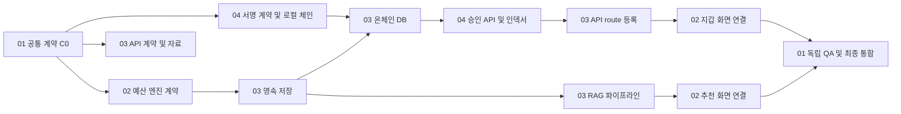

# 4개 에이전트 병렬 작업 프롬프트

이 폴더의 **YAML은 정확히 4개**이며 파일 번호 순서로 에이전트에 배정한다. 공통 정책·소유권·할당 예시·인계 형식을 각 파일에 포함했으므로 별도 common/workflow YAML이 필요 없다. 실행 결과는 Markdown으로 남긴다.

기존 12개 역할과 16개 YAML 구성을 대체한다. [상세 계획](../../architecture/implementation/README.md)의 P1/P2/P3 원래 작업 20개는 유지하고, 병렬 인계를 위한 보조·분할 작업을 포함해 실행 항목 27개로 배치했다. 새로운 제품 기능을 추가한 것은 아니다.

## 1. 번호순 배정

| 순서 | 프롬프트 | 담당 범위 | 실제 파일 수정 책임 |
| --- | --- | --- | --- |
| 01 | [01-coordinator-qa.yaml](01-coordinator-qa.yaml) | 총괄·설계·독립 리뷰/QA | 계약·ADR·검증 보고서·E2E 테스트 |
| 02 | [02-performance-frontend.yaml](02-performance-frontend.yaml) | 성능·예산 엔진·프론트엔드·공유 환경 | domain·types·UI·브라우저 API·루트 package/CI |
| 03 | [03-backend-rag.yaml](03-backend-rag.yaml) | 백엔드·DB·RAG 전체 | API·DTO·모든 migration/repository·수집·검색·생성 |
| 04 | [04-onchain.yaml](04-onchain.yaml) | Hardhat·승인 서버·인덱서 | chain·stamp controllers/application·signing/RPC·indexer |

**총괄 01을 포함해 최대 4개 인스턴스**다. 별도 리뷰어/QA/하위 에이전트를 추가 생성하지 않는다. 01이 제품 구현을 하지 않고 독립 검증을 맡으며, 01 자신이 작성한 계약·검증 코드는 02가 교차 검토한다.

번호는 배정 순서이며 전체 작업을 01→02→03→04로 직렬 실행하라는 뜻이 아니다. 네 파일은 지시서이며 자동 스케줄러가 아니다. 파일을 읽거나 생성하는 것만으로 구현/공개 배포가 실행되지 않는다.

## 2. 병렬 진행 순서

| 구간 | 01 총괄·QA | 02 성능·UI | 03 백엔드·RAG | 04 온체인 |
| --- | --- | --- | --- | --- |
| 최초 준비 | C0 계약·경로 배정 | P1-01 기준 측정, C0 교차 검토 | API 및 출처 조사 | 서명/계약 요구 초안 |
| C0 인계 후 | 들어오는 변경 즉시 리뷰 | 환경·P1-02 엔진 계약 | P1-05 API, P2-01 자료/평가셋 | P3-01 명세와 DB 요구 조기 전달 |
| 엔진 계약 인계 후 | 계약 소비자 정합성 확인 | P1-03/04 성능·UI | P1-06 저장, P3-DB 우선 인계 | P3-02/03 로컬 계약·공격 테스트 |
| 기능 연결 | P1 통합 QA, RAG 정답 검수 | UI-CONTRACTS로 두 기능 화면 선행 준비 | RAG 수집·검색·생성, 온체인 route 짧은 우선 처리 | P3-04 승인 서버, P3-06 인덱서 |
| 실제 API 준비 후 | 제출된 기능별 독립 검증 | P2-05/P3-05 실제 화면 연결 | RAG 평가 실행기·제한·수정 대응 | 계약/서버/복구 수정 대응 |
| 최종 | P1/P2/P3 게이트 및 전체 데모 | UI·runbook 마무리 | API·RAG 수정 | 체인·동기화 수정 |

표의 각 열 안에서는 한 에이전트가 ready 작업을 순차 수행한다. 동일 에이전트에게 두 작업을 동시에 실행하라고 요구하지 않는다. 각 YAML의 depends_on이 실제 연결 시점을 결정한다.

P1 전체 완료는 RAG 자료 준비나 로컬 계약 개발의 선행 조건이 아니다. API/타입/fixture만 준비되면 독립 작업을 진행한다. 단, 세 기능 통합 완료는 P1-07·P2-06·P3-07의 실제 검증 결과가 모두 필요하다.

## 3. 핵심 인계와 병목 방지



- **02→03:** P1-02 직후 타입·예산 엔진·참조 fixture를 전달한다. 성능 최적화 전체를 기다리지 않는다.
- **04→03:** P3-01 직후 stamp repository와 DB 요구를 전달한다. 계약 개발 완료 후 요청하지 않는다.
- **03→04:** P3-DB를 장기 RAG 튜닝보다 먼저 처리한다. 기다리는 동안 04는 메모리 test double로 승인·인덱서 테스트를 준비한다.
- **04→03→02:** controller factory → API route 등록 → 실제 지갑 연결 순서다. 04가 app.ts를 직접 수정하지 않는다.
- **03/04→02:** 응답·ABI fixture를 미리 전달한다. 02는 서버 대기 중에도 실패 상태와 화면을 검증한다.
- **03/04→02:** 루트 패키지/스크립트 요청은 짧게 묶어 처리한다. chain의 의존성은 04가 직접 관리한다.
- **모든 구현자→01:** 전체 작업 종료까지 리뷰를 미루지 말고 작은 검토 단위와 정확한 commit/patch를 전달한다.

## 4. 파일·실행 자원 충돌 방지

동일 파일 작성자는 한 명이다. 네 YAML에 동일한 ownership_registry가 포함되며 validate.cjs로 복사본 일치를 검사한다. 소유권 밖 수정은 허용 범위를 임의 확장하지 말고 필요한 인터페이스/fixture와 함께 담당자에게 요청한다.

| 공유 자원 | 담당자 | 규칙 |
| --- | --- | --- |
| 루트 package/lockfile/CI | 02 | 03/04는 요청을 인계. 동시에 의존성을 설치·추가하지 않음 |
| chain/package/lockfile | 04 | 루트 설정과 분리 |
| domain/types | 02 | 소비자는 기존 타입을 import하고 계약 변경을 요청 |
| 서버 DTO·app.ts | 03 | stamp controller는 04, 실제 route 등록은 03 |
| DB migration/repository | 03 | 04가 별도 migration을 생성하지 않음 |
| 정식 benchmark | 01이 시간 조정, 02 실행 | 같은 머신의 대량 모델/계약 테스트를 잠시 분리 |
| 테스트 DB | 03이 namespace 배정 | 다른 작업의 DB를 clear/reset하지 않음 |
| 로컬 체인 | 04 | reset/reorg 실험은 소비자와 시간을 조정 |

worktree가 가능하면 02/03/04를 같은 base commit에서 분리한다. 각 인계에는 기준 commit과 결과 commit 또는 patch를 기록하고 소비자는 수용된 버전만 사용한다. 공유 checkout에서는 동일 파일 수정뿐 아니라 git switch/merge/cherry-pick의 동시 실행도 금지한다. 작업 브랜치 간 통합은 01이 조정하고 변경 소유자가 수행한다. main merge와 공개 배포는 별도 권한 범위다.

## 5. 실제 전달할 프롬프트

각 에이전트에 자신의 파일 하나를 전달한다. 공통 지침은 파일 안에 있으며 외부 YAML 상속을 요구하지 않는다. 계획 문서와 AGENTS.md는 저장소에서 읽는다.

```text
작업 저장소: C:/WorkSpace/MGG/github-upgrades/busan-alley-balancer
docs/prompts/upgrade-agents/01-coordinator-qa.yaml을 읽고
이 파일의 역할과 범위에 따라 작업하라.
이번 요청은 실행 계획 작성(mode=plan)이다.
4개 에이전트 안에서 각 파일의 work_items와 depends_on을 기준으로 배정하라.
추가 에이전트를 생성하지 말고 기존 세션의 승인 범위를 확인하라.
실제 구현을 시작했다고 보고하지 말고 C0와 배정 초안을 작성하라.
```

구현을 요청할 때는 해당 역할 파일과 함께 mode=implement, work_item_id, run_id, base_commit, checkout_path, assigned_paths, accepted_handoffs, authorization_evidence, acceptance_criteria를 제공한다. YAML 안 assignment_example은 형식 예시이며 값이 비어 있는 상태로 실행을 승인하지 않는다.

```text
02-performance-frontend.yaml을 읽고 다음 할당을 수행하라.
mode: implement
work_item_id: P1-01
run_id: 실제 실행마다 고유한 값
base_commit: git에서 확인한 실제 SHA
checkout_path: 배정된 checkout의 실제 절대 경로
assigned_paths: benchmarks/**, docs/reports/performance/**,
                docs/reports/handoffs/agent_02/**
accepted_handoffs: 없음(P1-01은 선행 의존성 없음)
authorization_evidence: 현재 사용자의 P1-01 실행 요청
acceptance_criteria: YAML의 P1-01 기준 측정 및 현재 결함 기록
```

위 SHA/경로/승인 예시는 실제 값으로 교체한다. 제품 구현 승인이 이미 있는 세션에서는 같은 승인을 다시 요구하지 않는다. 미결정 정책은 영향받는 작업만 분리하고 독립 준비를 계속한다.

인계 문서는 docs/reports/handoffs/agent_XX/{work_item_id}-{run_id}.md에 기록한다. 런타임 상태를 네 YAML에 덮어쓰지 않는다. 01의 조정 기록과 GitHub 작업 상태(연결된 경우)가 진행 상황을 추적한다.

## 6. 검증

```powershell
npm install --prefix "$env:TEMP/mgg-yaml-validation" yaml@2 --ignore-scripts --no-audit --no-fund
node docs/prompts/upgrade-agents/validate.cjs --yaml-module "$env:TEMP/mgg-yaml-validation/node_modules/yaml"
```

검사 항목: 정확히 YAML 4개, 번호/에이전트 일치, 공통 정책/소유권 동일성, 실행 항목 27개, 원래 작업 20개 보존, 의존 순환 없음, 담당자·검토자 분리, priority queue 완전성, 문서 참조 존재 여부. 에이전트 실제 실행이나 제품 기능 테스트를 대신하지 않는다.
